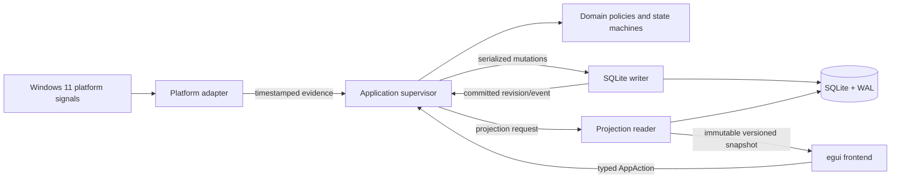

# OpenManic MVP technical specification

- Status: approved planning baseline
- Product source: [`../openmanic-gui-product-requirements.md`](../openmanic-gui-product-requirements.md)
- Primary release: Windows 11 x86-64
- Future platform target: NixOS x86-64 with a capability-probed adapter
- Implementation baseline: Rust 2024 and egui/eframe 0.35

## 1. Purpose

This specification turns the approved OpenManic GUI product requirements into an implementation-ready technical design. It defines the system boundaries, runtime model, platform-adapter contract, canonical data model, repository organization, code-quality policy, persistence and recovery rules, performance budgets, and distribution behavior required to build the MVP.

The product requirements remain canonical for user-visible behavior. This specification is canonical for implementation details. If the documents appear to disagree:

1. Preserve the product requirement.
2. Treat the technical behavior in this directory as the implementation contract.
3. Update both documents deliberately if resolving the conflict changes visible behavior.

All unqualified `MUST` requirements in the product document remain in the MVP. The implementation phases in that document are increments toward one Windows release, not separate product releases.

## 2. Document map

| Document | Owns |
| --- | --- |
| [System architecture](architecture.md) | Process, threads, crate boundaries, commands, events, snapshots, backpressure, lifecycle, and failure isolation |
| [Data model](data-model.md) | Canonical entities, IDs, relationships, temporal rules, recurrence, SQLite representation, migrations, recovery, backup, and CSV boundaries |
| [Platform adapters](platform-adapters.md) | Capability model, Windows foreground detection, stable application identity, platform evidence, and future NixOS adapters |
| [Project structure](project-structure.md) | Cargo workspace, directory tree, module ownership, dependency rules, crate policy, and development entry points |
| [Code quality and readability](code-quality-standards.md) | Formatting, workspace lints, unsafe boundaries, documentation, test hygiene, dependency checks, Rust-only automation, and review standards |
| [Implementation and agent execution](implementation-plan.md) | Ordered work packages, Terra task briefs, branch/worktree isolation, evidence manifests, verification policy, integration gates, and release sequencing |
| [UI implementation](ui-implementation.md) | Responsive grid, widget registry, theme schema, timeline projections, interaction arbitration, and presentation-state contracts |
| [Performance and reliability](performance-and-reliability.md) | Responsiveness budgets, benchmarks, assertions, errors, panic behavior, durability, diagnostics, and verification |
| [Delivery and setup](delivery-and-setup.md) | Portable artifacts, data-directory selection, single-instance behavior, tray/autostart, updates, and NixOS packaging constraints |

## 3. Settled technical decisions

The following decisions are binding for the MVP unless an implementation spike produces evidence that a requirement cannot be met:

- Rust 2024 is the language edition.
- egui/eframe 0.35 is the initial GUI baseline; egui and eframe versions are pinned together.
- OpenManic is one operating-system process with strict logical frontend/backend boundaries.
- The UI renders immutable presentation snapshots and emits typed actions. It never queries SQLite, polls the operating system, expands recurrence, or performs full-range aggregation.
- Background orchestration uses managed named threads and bounded synchronous communication. Tokio and Rayon are not MVP dependencies unless profiling establishes a specific need.
- The initial workspace contains six crates. Focus, schedule, analytics, widgets, and theme handling begin as named modules rather than additional crates.
- SQLite is bundled into each release artifact. One writer connection serializes authoritative mutations; one projection reader is the initial read worker.
- SQLite begins in WAL mode with `synchronous=FULL`. Any weaker durability mode requires measured evidence and an explicit product exception.
- Stored instants are signed UTC Unix microseconds. Intervals are half-open: `[start, end)`.
- Repeating schedules are civil-time rules in one global schedule time zone; they are not stored only as UTC instants.
- The global time zone is auto-detected by default and can be set manually.
- A time-zone change does not move an occurrence that has already started. Each future repeat keeps the same clock time in the newly selected zone. Internally, each affected series gets a new rule segment at its first occurrence after the change.
- A schedule time inside a daylight-saving gap moves forward to the first valid time. An ambiguous repeated time uses the earlier occurrence. The UI identifies adjusted occurrences.
- Each application has zero or one category. Changing the assignment updates historical category projections because activity owns an application identity, not a copied category.
- Window titles are optional observations. They never identify an application and never split an application-activity interval.
- Accepted titles are stabilized for approximately two seconds, bounded, deduplicated, and stored as separate title spans.
- Historical activity, accepted title spans, focus sessions, categories, and schedules are retained permanently by default.
- Windows 11 x86-64 is the first supported release target.
- NixOS support follows Windows. The first planned target is stock NixOS 26.05 with Sway 1.11 using direct Sway IPC. Generic Wayland support is not claimed.
- The Windows artifact is a portable executable. The user replaces it manually to update.
- Application data defaults to `OpenManicData` beside the artifact. The user can select another directory.
- If the artifact location is not writable, only a small per-user locator may be stored in OS configuration; all substantive application data remains in the selected directory.
- CSV covers human-readable activity/application/category interchange. A SQLite online backup is the full-fidelity backup.
- Encryption is post-MVP and, if introduced, is opt-in.

## 4. Architecture at a glance

The important boundary is directional: platform and storage adapters supply capabilities to the application layer, while the UI depends only on domain/application contracts. Concrete adapters never become dependencies of the domain or UI.

## 5. Canonical ownership

| Concern | Write authority | UI representation |
| --- | --- | --- |
| Current tracking interval and state | Tracking service through SQLite writer | Projected current-state snapshot |
| Activity history | SQLite repositories | Timeline and aggregate snapshots |
| Applications and categories | Category/application service | Lists, filters, and projected totals |
| Personal schedules and recurrence | Schedule service | Expanded schedule occurrences |
| Focus session lifecycle | Focus state machine | Focus snapshot and live remaining-time calculation |
| Saved layout and views | Application service through SQLite writer | Active validated documents |
| Theme selection | Persisted settings | Resolved theme applied atomically by UI |
| Hover, drag, menu, and animation state | UI only | Transient egui/controller state |
| Background job lifecycle | Application supervisor | Correlated progress and result state |

## 6. Requirement language

- `MUST` is required for the MVP.
- `SHOULD` is the expected implementation unless a documented measurement or platform limitation justifies another choice.
- `MAY` is optional or an implementation freedom that does not change the product contract.
- `Post-MVP` is explicitly excluded from the first Windows release.

## 7. Explicitly deferred work

The specification preserves extension points but does not include:

- Runtime-loaded Rust plugins, declarative third-party widgets, or WebAssembly widgets.
- Cloud accounts, synchronization, telemetry, or online update checking.
- Encryption-at-rest implementation.
- Universal Wayland, GNOME, KDE, or Hyprland support.
- Full custom-graph keyboard navigation and screen-reader equivalence.
- Automatic category rules.
- Calendar week view.
- Theme editor/import/export.
- Full relational CSV round-tripping of every application entity.

## 8. Research basis

The design was researched independently across Rust/egui architecture, Windows APIs, NixOS/display-server behavior, and SQLite/temporal modeling, then reviewed by a separate verification pass. Important primary references include:

- [Cargo workspaces](https://doc.rust-lang.org/cargo/reference/workspaces.html)
- [eframe application lifecycle](https://docs.rs/eframe/latest/eframe/trait.App.html)
- [egui repaint API](https://docs.rs/egui/latest/egui/struct.Context.html)
- [Microsoft `SetWinEventHook`](https://learn.microsoft.com/en-us/windows/win32/api/winuser/nf-winuser-setwineventhook)
- [Microsoft `GetForegroundWindow`](https://learn.microsoft.com/en-us/windows/win32/api/winuser/nf-winuser-getforegroundwindow)
- [SQLite WAL](https://www.sqlite.org/wal.html)
- [SQLite synchronous modes](https://www.sqlite.org/pragma.html#pragma_synchronous)
- [Jiff time-zone model](https://docs.rs/jiff/latest/jiff/tz/)
- [Wayland foreign-toplevel protocol](https://wayland.app/protocols/ext-foreign-toplevel-list-v1)
- [Sway IPC manual](https://github.com/swaywm/sway/blob/master/sway/sway-ipc.7.scd)

Research was current as of 2026-07-18. Dependency versions other than the approved egui/eframe baseline MUST be selected and pinned from a tested lockfile when implementation begins.
