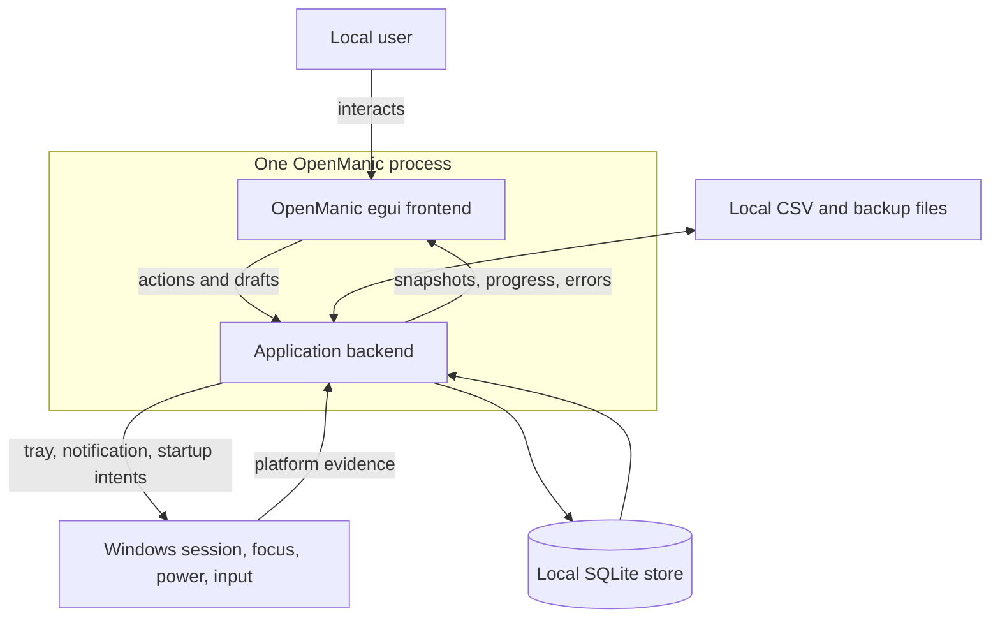
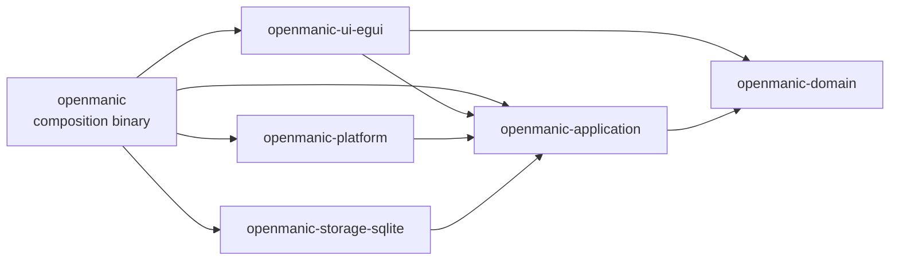
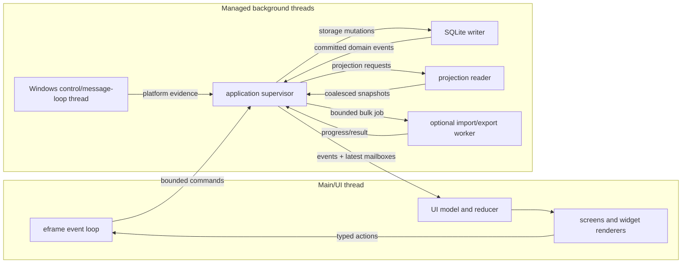
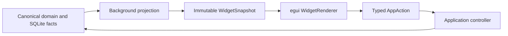
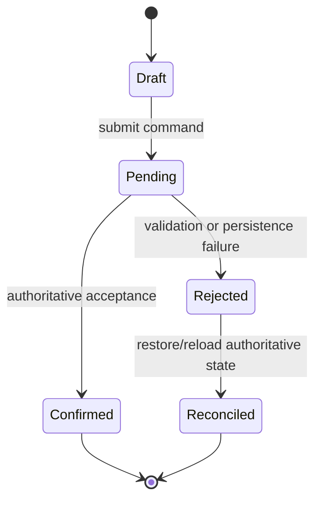
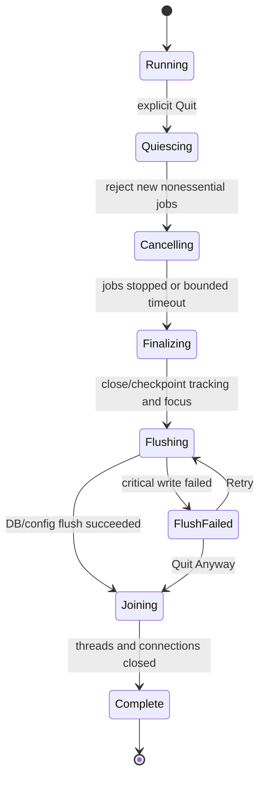

# OpenManic MVP system architecture

## 1. Scope

This document defines the application architecture needed to implement the approved GUI product requirements while keeping tracking and persistence reliable and the egui thread responsive.

The application is one operating-system process. “Frontend” and “backend” describe enforced dependency and execution boundaries, not separate executables or a network API.

## 2. Quality attributes

The architecture prioritizes, in order:

1. Correct and recoverable activity history.
2. Immediate and smooth user-visible response.
3. Clear ownership and readable code.
4. Failure isolation between UI, tracking, storage, imports, and projections.
5. Lightweight startup, memory use, dependency set, and distribution.
6. Platform extensibility through capability-probed adapters.

## 3. System context



There are no accounts, remote services, cloud telemetry, or network dependencies in the MVP.

## 4. Crate dependency architecture



### 4.1 Enforced dependency rules

- `openmanic-domain` MUST NOT depend on egui, eframe, SQLite, channels, Windows APIs, or filesystem layout.
- `openmanic-application` MUST depend only on domain types and infrastructure-neutral libraries. It owns ports that concrete adapters implement.
- `openmanic-storage-sqlite` and `openmanic-platform` MUST implement application-owned ports.
- `openmanic-ui-egui` MUST NOT depend on concrete storage or platform crates.
- The `openmanic` binary is the only composition root and the only crate that constructs concrete adapters together.
- `egui`, `eframe`, and their types MUST appear only in `openmanic-ui-egui` and the composition boundary required to start eframe.
- Product rules MUST NOT live in the binary, platform adapter, storage adapter, or widget renderer.

## 5. Runtime topology

The MVP uses managed named synchronous threads. It does not require Tokio.



### 5.1 Initial threads

| Thread | Owns | Must not do |
| --- | --- | --- |
| Main/UI | eframe/winit loop, `UiModel`, reducers, presentation snapshots, painting, hit testing, transient interaction | Blocking receive, DB query, OS polling, recurrence expansion, full-history aggregation |
| Application supervisor | Command ordering, job registry, cancellation, service health, revision routing, shutdown coordination | Paint or manipulate egui types |
| Windows control | Hidden Win32 window, message loop, focus/session/power evidence, tray callbacks | Query SQLite or perform significant callback work |
| SQLite writer | Sole read/write connection, transactions, migrations, checkpoints, authoritative revision | UI communication that can block a transaction |
| Projection reader | One query-only connection, short read transactions, projections and snapshot construction | Authoritative writes or long-lived SQLite read transactions |
| Bulk worker | CSV parse/write or other bounded file work while a job exists | Direct UI mutation or unbounded batches |

One projection reader is the starting point. Profiling MAY justify a second reader or a private CPU pool. The implementation MUST not add workers simply because parallelism is available.

### 5.2 Thread lifecycle

Every managed thread MUST have:

- A stable name.
- A single owner in the supervisor.
- A bounded input path.
- A stop token.
- A defined join order.
- A health state.
- A root panic boundary.
- A documented restart policy.

Projection and noncritical bulk workers MAY be restarted after a panic. A writer panic is storage-fatal and MUST transition the application to a protected failure state rather than silently starting a new writer.

## 6. Foreground/backend contract

The required data flow for every data-driven widget is:



### 6.1 Foreground responsibilities

The foreground MUST:

- Drain available events without blocking.
- Reconcile them into `UiModel` through controlled reducers.
- Render only presentation-ready snapshots.
- Acknowledge actions immediately with a pending/draft state when safe.
- Preserve a valid prior snapshot while a refresh runs.
- Request repaints only for input, visible animation, live time, or newly published state.
- Keep hover, open menu, draft text, drag, and animation state transient.

The foreground MAY perform cheap rectangle-dependent work:

- Map prepared timestamps to pixels.
- Clip visible geometry.
- Lay out text.
- Binary-search a prepared interval index.
- Read cached geometry keyed by bounds and revision.

### 6.2 Backend responsibilities

The backend MUST:

- Own tracking, storage, recurrence expansion, aggregation, imports, and expensive icon work.
- Validate every authoritative mutation.
- Serialize conflicting writes.
- Publish versioned events and immutable snapshots.
- Cancel superseded work where safe.
- Coalesce replaceable state.
- Preserve critical outcomes and mutation ordering.
- Protect tracking and persistence when the UI is hidden or stalled.

## 7. Command, event, and snapshot contracts

The following are contract shapes, not required field-level Rust syntax.

### 7.1 IDs

```text
CommandId        unique per submitted command
JobId            stable for a background operation
RequestId        unique per projection request
EntityId         opaque stable ID for a domain entity
WidgetInstanceId opaque stable dashboard instance ID
DataRevision     monotonically increasing committed store revision
SchemaRevision   version of a serialized command/event/snapshot shape
```

IDs MUST be newtyped. Storage row IDs, Win32 handles, PIDs, and egui IDs MUST NOT leak across the application boundary as domain identity.

### 7.2 Command envelope

```rust
struct CommandEnvelope {
    schema_revision: u16,
    command_id: CommandId,
    ordering_key: OrderingKey,
    expected_entity_revision: Option<u64>,
    submitted_at_utc: UtcInstant,
    payload: Command,
}
```

`OrderingKey` identifies the entity or service whose mutations require order, such as tracking, one category, one schedule series, one layout, or the focus singleton.

Commands that mutate user data MUST be delivered losslessly once accepted by the supervisor. The UI MUST use a nonblocking send. If the command channel is temporarily full, the UI keeps a small bounded outbox, displays a busy/pending state, and retries on a later frame. It MUST never block or silently discard the command.

### 7.3 Event envelope

```rust
struct EventEnvelope {
    schema_revision: u16,
    sequence: u64,
    causation_command_id: Option<CommandId>,
    committed_data_revision: Option<DataRevision>,
    occurred_at_utc: UtcInstant,
    payload: AppEvent,
}
```

Critical events include mutation confirmation/rejection, committed tracking boundaries, service failure, persistence failure, and final job outcome. They MUST not be replaced by progress events.

### 7.4 Projection request and snapshot

```rust
struct ProjectionRequest {
    request_id: RequestId,
    slot: ProjectionSlot,
    context_key: ProjectionContextKey,
    required_data_revision: DataRevision,
    cancellation: CancellationToken,
    payload: ProjectionKind,
}

struct SnapshotEnvelope<T> {
    request_id: RequestId,
    slot: ProjectionSlot,
    context_key: ProjectionContextKey,
    source_data_revision: DataRevision,
    snapshot_schema_revision: u16,
    value: Arc<T>,
}
```

`ProjectionContextKey` is the normalized hashable combination of the request’s effective date/range, time zone, filters, selection, grouping, sort, widget configuration revision, and theme-independent projection options.

The UI accepts a snapshot only when:

1. The target slot or widget still exists.
2. The request ID is still current for that slot.
3. The context key matches current UI context.
4. The source revision is not older than the last accepted revision.

Cancellation reduces wasted work but is not the correctness mechanism. Late work may still finish; correlation and revision checks prevent stale application.

## 8. Communication and backpressure

### 8.1 Lanes

The runtime uses separate paths for different loss semantics:

| Lane | Policy |
| --- | --- |
| User/domain commands | Bounded, ordered by key, lossless after supervisor acceptance |
| Critical events | Bounded, lossless, drained before replaceable updates |
| Platform callback ingress | Preallocated and bounded; overflow sets an atomic evidence-loss marker |
| Widget/view snapshots | Latest value per projection slot replaces older value |
| Job progress | Latest progress per `JobId` replaces older progress |
| Repaint hints | Freely coalesced |
| Diagnostic traces | Bounded and may drop low-severity entries with a dropped-count metric |

### 8.2 Evidence loss

No bounded queue can guarantee complete focus history under arbitrary overload. If the platform callback ingress overflows:

1. Set an evidence-loss flag without blocking the callback.
2. The platform thread publishes `EvidenceLost` at the earliest safe opportunity.
3. Close trusted attribution at the last processed boundary.
4. Represent the uncertain period as `UnknownMissing` until a fresh foreground reconciliation succeeds.
5. Record the overflow in local diagnostics and a counter.

The adapter MUST NOT silently extend the previous application across the uncertain period.

### 8.3 UI draining

The UI event drain SHOULD stop after either:

- Approximately 1 ms of work, or
- A configured maximum number of critical events, initially 256.

If work remains, it requests another immediate repaint. These numbers are tuning defaults, not correctness constants.

## 9. Repaint and live-time policy

Workers clone a small `UiWaker` containing `egui::Context` and call `request_repaint` only after publishing new state.

The UI uses `request_repaint_after` for the next visible timer change. Tracking and Pomodoro services do not send per-frame ticks:

- A live activity interval snapshot carries an authoritative start and most recent confirmation.
- A running focus snapshot carries its authoritative deadline.
- The UI derives a displayed duration or remaining time from the snapshot and a runtime clock.
- Hiding or stalling the UI does not change the authoritative timer.

## 10. UI state and optimistic reconciliation

`UiModel` owns:

- Current route.
- Selected date/range.
- Shared selection and filters.
- Current immutable snapshot references.
- Dashboard layout draft/active state.
- Schedule editor draft.
- Pending command states.
- Surfaced errors and jobs.

It does not own persisted truth.

Every optimistic mutation follows:



Starting a focus session may immediately display `Starting`, but it displays `Running` only after the focus service accepts the command. A late response to an older command MUST NOT overwrite a newer draft.

## 11. Tracking reducer

The platform adapter produces evidence; the application tracking reducer owns canonical intervals.

Reducer inputs include:

- Foreground observations.
- User pause/resume.
- Idle threshold crossing and return.
- Session lock/unlock/connect/disconnect.
- Suspend/resume evidence.
- Confirmed shutdown/session end.
- Adapter availability and evidence loss.
- Clock discontinuity.
- Application exclusion policy.

The reducer MUST:

- Maintain non-overlapping half-open intervals.
- Apply documented cause precedence.
- Coalesce adjacent equivalent intervals where no meaningful boundary is required.
- Never infer Powered Off from a gap.
- Checkpoint its current open state independently of the UI.
- Emit a persistence mutation and data revision for authoritative transitions.

Cause precedence from highest to lowest is:

1. Explicit user pause.
2. Confirmed shutdown/powered-off evidence.
3. Session locked/disconnected or system suspended.
4. Adapter unavailable/evidence lost.
5. Excluded application.
6. Idle threshold crossed.
7. Resolved active foreground application.

The data vocabulary and exact causes are defined in [Data model](data-model.md).

## 12. Storage coordination

The writer owns the only read/write connection. A mutation transaction:

1. Loads the entity revision or neighboring intervals required for validation.
2. Validates the command against current authoritative state.
3. Writes domain changes and recovery checkpoint changes.
4. Increments `store_metadata.data_revision` in the same transaction.
5. Commits.
6. Publishes an event containing the committed revision.

The projection reader:

1. Opens a short read transaction.
2. Reads the required rows and `data_revision` from the same SQLite snapshot.
3. Copies them into owned Rust values.
4. Ends the read transaction.
5. Performs aggregation, recurrence expansion, sorting, and downsampling outside SQLite.
6. Publishes an immutable snapshot carrying that source revision.

This prevents CPU projection work from pinning the WAL.

## 13. Job model

```rust
enum JobState {
    Queued,
    Running { progress: Progress },
    Cancelling,
    Succeeded,
    Cancelled,
    Failed { error: UserFacingError },
    Interrupted,
}
```

- Operations expected to exceed 250 ms MUST create a visible job or meaningful background activity state.
- Cancellation MUST be idempotent.
- Read/projection jobs can cancel immediately at safe checks.
- Writes become non-cancellable once their commit phase begins.
- Import cancellation is honored at staging or bounded transaction boundaries.
- Final state MUST remain discoverable until acknowledged when action is required.

Only jobs whose recovery matters across restart—migration, data move, backup, or import—are persisted. Ordinary query and projection jobs are in memory.

## 14. Failure isolation

| Failure | Required behavior |
| --- | --- |
| Platform adapter temporary loss | Close trusted activity, record `Unavailable`/`UnknownMissing`, show recovery status, retry probe |
| Projection/query failure | Preserve previous snapshot, mark refresh failed, allow retry |
| Projection worker panic | Mark job failed, recreate worker/read connection, preserve UI |
| Import/export failure | Roll back staging/uncommitted work, report exact committed scope |
| Icon decode failure | Use fallback icon and local diagnostic |
| Invalid saved layout/theme | Preserve invalid source for diagnostics, use prior valid/default value |
| SQLite write failure | Stop claiming successful mutation; protect tracker state in memory; expose Retry/recovery |
| SQLite writer panic/corruption | Enter storage-fatal state; do not silently restart writer |
| UI invariant panic | Write minimal diagnostic, attempt bounded coordinated shutdown, exit nonzero; do not resume GUI |

Expected errors use typed `Result` values. Programmer invariant failures may panic according to [Performance and reliability](performance-and-reliability.md).

## 15. Normal shutdown



Join order is:

1. Stop accepting new nonessential commands.
2. Cancel safe projection and bulk work.
3. Finalize or checkpoint the tracker and focus session.
4. Flush atomic settings/layout changes.
5. Stop and join the projection reader and bulk worker.
6. Checkpoint/close the SQLite writer.
7. Stop platform observation and remove tray resources.
8. Join the supervisor and allow eframe to exit.

`eframe::App::on_exit` is a final notification, not the primary asynchronous shutdown mechanism. Close-to-tray cancels viewport closing and does not begin shutdown.

## 16. Unexpected termination

Graceful shutdown cannot be guaranteed after forced termination, power loss, memory corruption, or a panic while holding a critical lock. Durability therefore relies on:

- SQLite transactions with the approved synchronous setting.
- A durable open-activity checkpoint at every transition and approximately every five seconds while an interval is open.
- A durable focus deadline/paused remainder.
- Atomic layout/settings documents.
- Pre-migration online backup.
- Recovery that labels uncertainty instead of inventing activity.

After restart, attribution after the last durable confirmation becomes `UnknownMissing` unless reliable OS evidence proves a different state.

## 17. Single-instance activation

The Windows MVP permits one running OpenManic process per signed-in user.

- A current-user-scoped named mutex provides fast detection.
- A current-user-ACL named pipe accepts `Activate`, `PauseTracking`, `ResumeTracking`, and future local commands.
- A separate exclusive lock tied to the resolved data directory prevents two writers even if instance coordination fails.
- A second launch sends `Activate` and exits.
- If Windows denies foreground activation, the existing instance restores the window and flashes it rather than claiming guaranteed focus.

No local activation command may expose application data to another user session.

## 18. Renderer selection

The first implementation uses one renderer feature per artifact:

- WGPU is the initial Windows candidate because it is eframe’s default.
- Glow is benchmarked in the architecture spike for executable size, cold startup, driver reliability, memory, and timeline frame time.
- The normal release MUST NOT compile both renderers.
- The selected renderer is a build-time feature, not a runtime preference.

Changing the renderer does not change domain, application, storage, platform, or snapshot contracts.

## 19. Architecture acceptance rules

The architecture is implemented correctly only when:

- The UI crate cannot reach concrete storage/platform APIs through its dependency graph.
- Hiding, minimizing, resizing, or stalling eframe does not stop tracking or focus timing.
- All UI-bound receives are nonblocking.
- Every authoritative mutation has a command ID and confirmation/rejection path.
- Stale projection results are rejected by ID, context, and revision.
- Queue overload produces visible degradation or coalescing according to its lane; it never silently loses authoritative state.
- A storage or tracker failure does not masquerade as successful tracking.
- Explicit Quit follows the coordinated lifecycle.
- Unexpected exit recovery does not fabricate application or Powered Off time.

## 20. Primary implementation references

- [Cargo workspace reference](https://doc.rust-lang.org/cargo/reference/workspaces.html)
- [eframe `App`](https://docs.rs/eframe/latest/eframe/trait.App.html)
- [egui `Context::request_repaint`](https://docs.rs/egui/latest/egui/struct.Context.html#method.request_repaint)
- [Crossbeam channel](https://docs.rs/crossbeam-channel/latest/crossbeam_channel/)
- [rusqlite `Connection`](https://docs.rs/rusqlite/latest/rusqlite/struct.Connection.html)
- [SQLite isolation](https://www.sqlite.org/isolation.html)
- [SQLite WAL](https://www.sqlite.org/wal.html)
