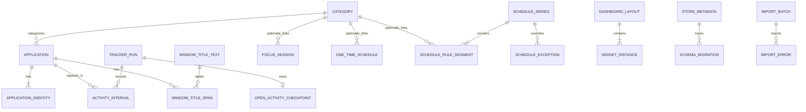
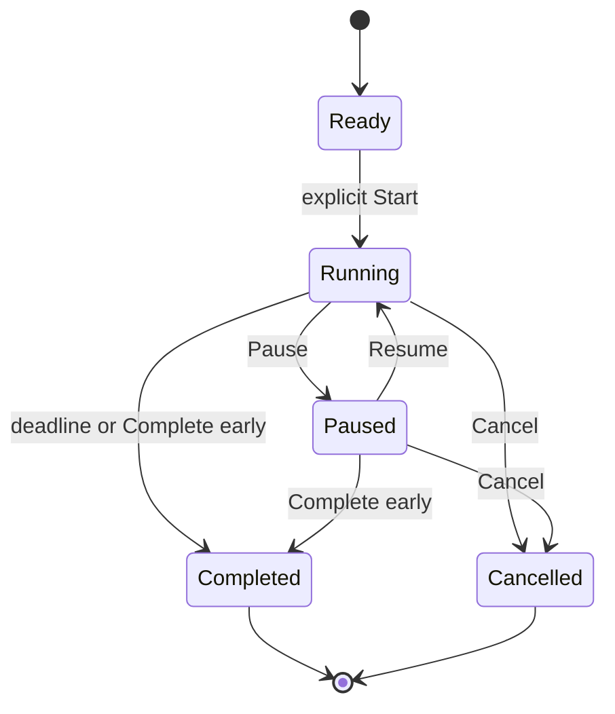
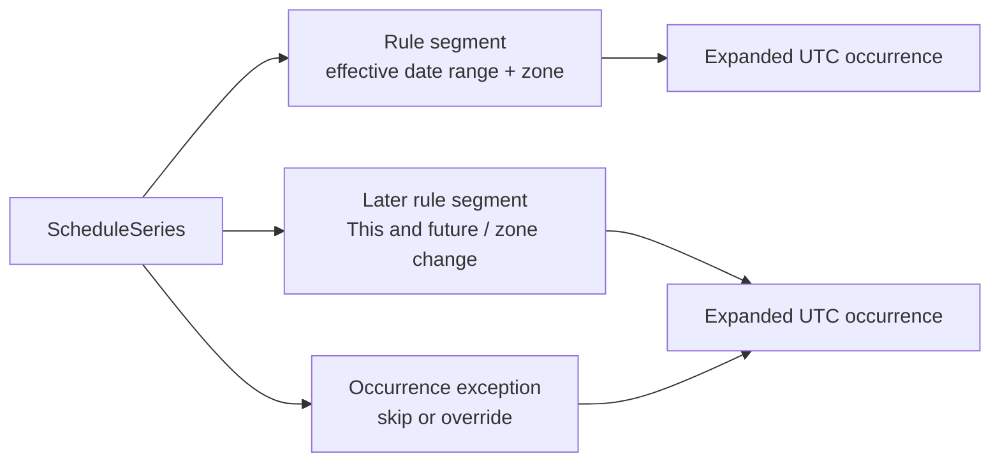

# OpenManic MVP data model

## 1. Purpose and ownership

This document is canonical for domain entities, stable IDs, interval/state vocabulary, relationships, temporal behavior, recurrence, validation invariants, SQLite representation, migrations, recovery, and backup/export boundaries.

The model is independent of egui. Presentation snapshots may copy or aggregate these facts, but they never become write authority.

## 2. Modeling principles

- Store facts and intent, not widget-specific calculations.
- Use explicit states and evidence rather than interpreting an unexplained gap.
- Store actual instants in UTC and recurring intent as local civil rules plus a time zone.
- Use half-open intervals `[start, end)` so adjacent intervals do not overlap.
- Make invalid states difficult to construct in Rust and impossible to commit where SQLite can enforce them.
- Keep application identity separate from transient process/window handles and titles.
- Keep permanent user history separate from rebuildable caches and diagnostics.
- Make every authoritative write part of a monotonic data revision.

## 3. Identifier policy

Domain IDs are opaque newtypes. The public/application contract does not expose SQLite row IDs.

| ID class | Representation | Used for |
| --- | --- | --- |
| High-volume storage row | SQLite `INTEGER PRIMARY KEY` | Activity intervals, title spans, migration rows |
| Stable domain ID | Application-generated 128-bit opaque value stored as `BLOB(16)` | Categories, applications, schedule series/items, focus sessions, layouts/views, tracker runs |
| Ephemeral runtime ID | Newtyped integer or 128-bit value, never persisted unless needed for recovery | Commands, jobs, requests, process/window observations |

Stable IDs MUST be generated before persistence and MUST survive export/import when the entity is included in that interchange format. Serialized IDs use one documented lowercase textual encoding; storage uses the 16-byte form.

## 4. Temporal representation

### 4.1 Instants

Every actual instant is stored as a signed 64-bit count of UTC microseconds from the Unix epoch:

```text
UtcMicros(i64)
```

SQLite columns end in `_utc_us`. Rust code uses a newtype and checked conversion. Floating-point time is forbidden.

### 4.2 Intervals

All intervals are half-open:

```text
[start_utc_us, end_utc_us)
```

Requirements:

- A closed interval has `end_utc_us > start_utc_us`.
- Adjacent intervals may satisfy `left.end == right.start`.
- Canonical activity intervals do not overlap.
- Focus and schedule intervals may overlap activity because they are intentional overlays, not replacements.
- Personal schedules do not overlap other personal schedules in the MVP.

### 4.3 Runtime elapsed time

Monotonic clocks are runtime evidence only. They are used to measure durations, recognize wall-clock discontinuity, and maintain timers without frame dependence. A Rust `Instant`, QPC counter, or equivalent MUST NOT be serialized as a restart-stable timestamp.

Persist the UTC start/deadline/checkpoint necessary for restart reconciliation.

## 5. Time-zone policy

### 5.1 One global schedule/display zone

The setting is:

```rust
enum TimeZoneSetting {
    Auto,
    Manual(IanaTimeZoneId),
}
```

- `Auto` resolves the operating-system time zone at startup, resume, and relevant OS setting changes.
- `Manual` uses a validated IANA time-zone identifier.
- Historical activity, one-time schedules, focus sessions, and title spans keep their UTC instants when the selected zone changes.
- Local day/week/month grouping is recalculated in the currently selected zone.
- A calendar day is bounded by one local midnight and the next local midnight. It MUST NOT assume 24 hours.

### 5.2 Readable rule for a time-zone change

If the user changes the time zone, schedule occurrences that have already started do not move. Each future repeat keeps the same clock time in the newly selected zone.

Example: a repeating schedule says “Monday at 09:00.” After changing from Karachi to London, future Mondays still show 09:00 in London. Mondays that already occurred retain their original UTC instants.

Internally, for each series OpenManic finds the first scheduled anchor date whose occurrence starts after the setting change. It ends the old rule segment before that anchor date and creates a new segment on that date with the same weekday/time fields and the new zone.

### 5.3 Daylight-saving gaps and folds

When expanding a civil boundary:

- If the local time does not exist because clocks move forward, resolve it to the first valid time after the gap.
- If the local time occurs twice because clocks move backward, choose the earlier instant.
- Mark the occurrence as adjusted and retain enough resolution metadata for the UI/export to explain it.
- Apply the policy to start and end independently, then require a positive resolved duration.

Jiff is the initial time-zone implementation candidate because it supports IANA rules, Windows-to-IANA mapping, and explicit gap/fold disambiguation.

## 6. Entity relationship model



## 7. Store metadata and revisions

### 7.1 `store_metadata`

Singleton row:

| Column | Type | Constraint/purpose |
| --- | --- | --- |
| `singleton_id` | INTEGER | `PRIMARY KEY CHECK(singleton_id = 1)` |
| `store_id` | BLOB | 16 bytes, stable store identity |
| `data_revision` | INTEGER | Nonnegative, increases in every authoritative mutation transaction |
| `schema_version` | INTEGER | Highest successfully applied migration |
| `created_utc_us` | INTEGER | Creation instant |
| `last_opened_app_version` | TEXT | Diagnostics/compatibility |
| `last_clean_shutdown_utc_us` | INTEGER NULL | Normal shutdown marker |

Every snapshot reads `data_revision` from the same read transaction as its facts.

### 7.2 `schema_migration`

| Column | Type | Constraint/purpose |
| --- | --- | --- |
| `version` | INTEGER | Primary key, strictly increasing |
| `checksum` | BLOB | Hash of immutable migration source |
| `applied_utc_us` | INTEGER | Apply time |
| `app_version` | TEXT | Applying binary |

`PRAGMA user_version` MAY mirror the highest migration but does not replace this ledger.

## 8. Categories, applications, and identity

### 8.1 `category`

| Column | Type | Constraint/purpose |
| --- | --- | --- |
| `id` | INTEGER | Internal primary key |
| `public_id` | BLOB | Unique stable ID |
| `display_name` | TEXT | Nonempty after trimming |
| `color_spec` | TEXT NULL | Validated semantic/data color |
| `icon_spec` | TEXT NULL | Validated icon reference |
| `description` | TEXT NULL | User text |
| `productivity_class` | INTEGER NULL | Versioned enum |
| `created_utc_us` | INTEGER | Required |
| `updated_utc_us` | INTEGER | Required |

Category names SHOULD be unique under the application’s normalized comparison rule to avoid indistinguishable choices. Renaming does not change `public_id`.

### 8.2 `application`

| Column | Type | Constraint/purpose |
| --- | --- | --- |
| `id` | INTEGER | Internal primary key |
| `public_id` | BLOB | Unique stable ID |
| `display_name` | TEXT | Best current product name |
| `display_name_override` | TEXT NULL | Optional user override |
| `category_id` | INTEGER NULL | FK to category, `ON DELETE SET NULL` |
| `exclusion_policy` | INTEGER | Versioned enum |
| `first_seen_utc_us` | INTEGER | Required |
| `last_seen_utc_us` | INTEGER | Required |
| `icon_digest` | BLOB NULL | Reference into rebuildable icon cache |

`category_id IS NULL` means Uncategorized. There is no stored Uncategorized category and no many-to-many category join.

Activity rows do not copy `category_id`. Historical category projections join the activity’s application to its current category. Therefore recategorizing an application intentionally updates compatible historical category totals and timeline projections.

### 8.3 `application_identity`

| Column | Type | Constraint/purpose |
| --- | --- | --- |
| `id` | INTEGER | Internal primary key |
| `application_id` | INTEGER | Required FK |
| `platform` | INTEGER | Windows, Sway, X11, future |
| `identity_kind` | INTEGER | AUMID, executable path, Wayland app ID, X11 class, unresolved |
| `normalized_value` | BLOB/TEXT | Stable normalized lookup value |
| `original_value` | TEXT NULL | Diagnostic/display representation |
| `confidence` | INTEGER | Exact, heuristic, unresolved |
| `first_seen_utc_us` | INTEGER | Required |
| `last_seen_utc_us` | INTEGER | Required |

Unique constraint:

```text
(platform, identity_kind, normalized_value)
```

One application may own multiple identities so upgrades, packaged/unpackaged variants, or a future user-assisted merge do not require rewriting activity.

PID, process creation time, HWND, Sway container ID, and X11 window ID are observation evidence, not persistent application identity.

## 9. Window-title observations

Titles are local optional history. They do not create applications and do not divide activity intervals.

### 9.1 Acceptance policy

- Observe only the current foreground root window.
- Normalize control characters and whitespace.
- Require approximately two seconds of stable observation before persistence.
- An interval shorter than the stability threshold may have no persisted title.
- Cap persisted title text at 2 KiB of UTF-8 after normalization.
- Hash and compare text before scheduling a write.
- Coalesce consecutive accepted spans with identical application and title.
- Never record raw titles in normal logs.
- Disabling collection stops future observation and does not silently erase prior history.

### 9.2 `window_title_text`

| Column | Type | Constraint/purpose |
| --- | --- | --- |
| `id` | INTEGER | Primary key |
| `text_hash` | BLOB | Indexed digest |
| `title` | TEXT | Repository enforces UTF-8 byte bound |

Hash collisions are resolved by comparing actual text. Unique identity is `(text_hash, title)`.

### 9.3 `window_title_span`

| Column | Type | Constraint/purpose |
| --- | --- | --- |
| `id` | INTEGER | Primary key |
| `application_id` | INTEGER | Required FK |
| `tracker_run_id` | INTEGER | Required FK |
| `title_text_id` | INTEGER | Required FK |
| `start_utc_us` | INTEGER | Accepted span start |
| `end_utc_us` | INTEGER | Positive half-open end |
| `source_revision` | INTEGER | Commit revision |

Title spans are queried by time intersection and application. They remain independent from canonical activity boundaries, so a rapidly changing browser title does not inflate the application list or activity interval count.

## 10. Activity tracking

### 10.1 Canonical state vocabulary

```rust
enum ActivityState {
    Active,
    Idle,
    PausedByUser,
    Excluded,
    Unavailable,
    PoweredOff,
    UnknownMissing,
}
```

State and cause are separate. Example causes include:

```text
ForegroundApplication
IdleThreshold
UserPause
ApplicationExcluded
SessionLocked
SessionDisconnected
SystemSuspended
AdapterStarting
AdapterPermissionLost
AdapterFailure
EvidenceQueueOverflow
ConfirmedShutdown
CrashRecoveryGap
ImportedUnknown
ClockDiscontinuity
```

### 10.2 State invariants

- `Active` requires a resolved `application_id`.
- `Excluded` does not retain title or unnecessary application details beyond the declared exclusion evidence.
- Other non-application states normally have no `application_id`.
- `PoweredOff` requires affirmative shutdown/end-session evidence and a later startup boundary.
- A time gap, process restart, sleep, or adapter loss alone is never `PoweredOff`.
- Sleep/hibernate is `Unavailable` with cause `SystemSuspended`; Windows cannot reliably distinguish the two.
- Lost focus evidence is `UnknownMissing` until reconciliation.

### 10.3 `tracker_run`

| Column | Type | Constraint/purpose |
| --- | --- | --- |
| `id` | INTEGER | Primary key |
| `public_id` | BLOB | Stable run ID |
| `started_utc_us` | INTEGER | Required |
| `ended_utc_us` | INTEGER NULL | Normal/observed end |
| `clean_end` | INTEGER | Boolean |
| `platform_session_marker` | TEXT NULL | Opaque diagnostic marker |
| `adapter_version` | TEXT | Required |
| `end_evidence` | INTEGER NULL | Normal quit, confirmed shutdown, crash-detected |

### 10.4 `activity_interval`

| Column | Type | Constraint/purpose |
| --- | --- | --- |
| `id` | INTEGER | Primary key |
| `tracker_run_id` | INTEGER | Required FK |
| `start_utc_us` | INTEGER | Required |
| `end_utc_us` | INTEGER | `end > start` |
| `state` | INTEGER | Checked enum |
| `cause` | INTEGER | Checked enum |
| `application_id` | INTEGER NULL | FK where allowed by state |
| `origin` | INTEGER | Tracked, imported, recovered |
| `uncertainty_us` | INTEGER | Nonnegative evidence uncertainty |
| `source_revision` | INTEGER | Commit revision |

Cross-row non-overlap is enforced by the serialized writer after loading neighboring intervals. SQL row constraints cannot express the full invariant.

Adjacent equivalent intervals SHOULD coalesce unless a boundary is important evidence, such as a clock discontinuity, import boundary, or tracker run transition.

### 10.5 `open_activity_checkpoint`

Singleton durable recovery row:

| Column | Type | Purpose |
| --- | --- | --- |
| `singleton_id` | INTEGER | `PRIMARY KEY CHECK(singleton_id = 1)` |
| `tracker_run_id` | INTEGER | Current run |
| `open_start_utc_us` | INTEGER | Current interval start |
| `last_confirmed_utc_us` | INTEGER | Last durable observation |
| `state` / `cause` | INTEGER | Current canonical meaning |
| `application_id` | INTEGER NULL | Current app when applicable |
| `platform_sequence` | INTEGER | Last applied evidence sequence |
| `checkpoint_revision` | INTEGER | Store revision |

Update it:

- At every state/application transition.
- At lock, suspend, resume, pause, quit, and confirmed end-session evidence.
- Approximately every five seconds while tracking remains in one state.

Closing an interval and replacing/removing its checkpoint MUST occur in one writer transaction.

### 10.6 Recovery

After unclean exit:

1. Recover the previous interval only through `last_confirmed_utc_us`.
2. Close that portion with origin `recovered` if it was not already closed.
3. Use reliable platform startup/shutdown evidence to create `PoweredOff` only when justified.
4. Otherwise represent the remaining gap to the first new observation as `UnknownMissing`.
5. Start a new tracker run and checkpoint.

The model prefers an honest unknown interval over invented application time.

## 11. Focus sessions

### 11.1 State model



### 11.2 `focus_session`

| Column | Type | Constraint/purpose |
| --- | --- | --- |
| `id` | INTEGER | Internal primary key |
| `public_id` | BLOB | Stable ID |
| `kind` | INTEGER | Focus or short break |
| `state` | INTEGER | Ready is normally a draft; persisted states are planned/running/paused/completed/cancelled |
| `label` | TEXT NULL | Optional task label |
| `category_id` | INTEGER NULL | Optional FK, `ON DELETE SET NULL` |
| `planned_start_utc_us` | INTEGER NULL | User planning input |
| `planned_end_utc_us` | INTEGER NULL | User planning input |
| `intended_duration_us` | INTEGER | Positive |
| `actual_start_utc_us` | INTEGER NULL | Required after start |
| `deadline_utc_us` | INTEGER NULL | Required while running |
| `paused_remaining_us` | INTEGER NULL | Required while paused |
| `completed_utc_us` | INTEGER NULL | Completion time |
| `cancelled_utc_us` | INTEGER NULL | Cancellation time |
| `revision` | INTEGER | Entity revision |

A partial unique index permits at most one session in a running or paused state.

Sleep counts against an unpaused UTC deadline. On restart:

- A running session past its deadline becomes Completed.
- A running session before its deadline resumes from that deadline.
- A paused session resumes paused with its stored remaining duration.

Focus is an overlay and may overlap any activity or schedule interval.

## 12. Personal schedules

### 12.1 Entity forms

One-time schedules store actual UTC instants. Repeating schedules store civil rules.



### 12.2 `one_time_schedule`

| Column | Type | Constraint/purpose |
| --- | --- | --- |
| `id` | INTEGER | Internal primary key |
| `public_id` | BLOB | Stable ID |
| `label` | TEXT | Nonempty |
| `category_id` | INTEGER NULL | Optional FK |
| `start_utc_us` | INTEGER | Required |
| `end_utc_us` | INTEGER | `end > start` |
| `created_zone_id` | TEXT | IANA zone used by editor |
| `created_utc_us` / `updated_utc_us` | INTEGER | Required |
| `revision` | INTEGER | Entity revision |

An end clock earlier than the start maps to the following day. Equal start/end is rejected; the MVP does not infer a 24-hour interval.

### 12.3 `schedule_series`

| Column | Type | Purpose |
| --- | --- | --- |
| `id` | INTEGER | Internal primary key |
| `public_id` | BLOB | Stable logical lineage |
| `created_utc_us` | INTEGER | Required |
| `deleted_utc_us` | INTEGER NULL | Soft lineage marker where needed for history |
| `revision` | INTEGER | Entity revision |

### 12.4 `schedule_rule_segment`

| Column | Type | Constraint/purpose |
| --- | --- | --- |
| `id` | INTEGER | Primary key |
| `series_id` | INTEGER | Required FK |
| `effective_start_date` | INTEGER | Local date encoded as days from civil epoch |
| `effective_end_date` | INTEGER NULL | Inclusive local date, absent means open future |
| `weekday_mask` | INTEGER | Nonzero 7-bit mask |
| `start_second_of_day` | INTEGER | `0..86399` |
| `end_second_of_day` | INTEGER | `0..86399` |
| `end_day_offset` | INTEGER | `0` or `1` |
| `time_zone_id` | TEXT | Valid IANA ID |
| `label` | TEXT | Nonempty |
| `category_id` | INTEGER NULL | Optional FK |
| `created_utc_us` | INTEGER | Required |
| `revision` | INTEGER | Segment revision |

For offset `0`, the end clock must be later than the start. An earlier end clock uses offset `1` and is clearly presented as overnight.

Segments for one series MUST NOT overlap in effective local-date coverage.

### 12.5 `schedule_exception`

Occurrence identity is:

```text
(series_id, anchor_local_date)
```

The anchor is the local date on which the original occurrence begins. It remains stable even if an override moves the occurrence.

| Column | Type | Constraint/purpose |
| --- | --- | --- |
| `id` | INTEGER | Primary key |
| `series_id` | INTEGER | Required FK |
| `anchor_local_date` | INTEGER | Required |
| `kind` | INTEGER | Skip or override |
| `override_start_utc_us` | INTEGER NULL | Required for override |
| `override_end_utc_us` | INTEGER NULL | Positive for override |
| `label_override` | TEXT NULL | Optional |
| `category_id_override` | INTEGER NULL | Optional |
| `resolved_zone_id` | TEXT NULL | Explanation/export context |
| `revision` | INTEGER | Required |

Unique constraint:

```text
(series_id, anchor_local_date)
```

### 12.6 Edit scope semantics

| User choice | Authoritative operation |
| --- | --- |
| Only this date | Insert/update a skip or fixed UTC override for the selected anchor date |
| This and future | End the current rule segment before the anchor date and insert a new segment effective on the anchor date |
| Every occurrence | Replace the series’ rule segments for past and future intent in one transaction |

Existing occurrence-only exceptions are preserved and revalidated. If a new base rule makes an exception invalid or overlapping, Save is blocked and the UI identifies the affected dates so the user can remove or edit those exceptions.

Changing the global time zone is a special future-only edit effective at each series' first not-yet-started occurrence, as described in Section 5.2.

### 12.7 Expansion

Projection expands rules only for the requested local date range plus the adjacent date required for overnight clipping.

For each matching anchor date:

1. Build local start/end civil values in the segment zone.
2. Resolve gaps/folds with the approved policy.
3. Convert to UTC microseconds.
4. Apply a matching exception.
5. Require positive duration.
6. Attach adjustment/provenance metadata.
7. Clip for Timeline/Calendar presentation without splitting the canonical occurrence.

An optional occurrence cache is bounded, versioned by rule, time-zone database, and query range, and fully rebuildable. It is never authoritative.

### 12.8 Overlap validation

The serialized writer is final authority. UI validation is advisory.

- One-time versus one-time: compare UTC half-open ranges.
- One-time versus repeating: convert the one-time span into the schedule zone, expand candidate anchor dates, and compare resolved UTC ranges.
- Repeating versus repeating: because the MVP uses one global schedule zone, compare effective date intersection, weekday/overnight coverage, and local half-open time ranges. Validate DST boundary candidates explicitly.
- Exceptions: expand and compare affected dates.
- Adjacency is valid; positive intersection is a conflict.

Save returns the stable ID, label, and exact time of each conflicting interval.

## 13. Dashboard layout and widget documents

### 13.1 `dashboard_layout`

The Today dashboard is stored as one atomic, versioned document:

| Column | Type | Purpose |
| --- | --- | --- |
| `id` | INTEGER | Singleton/current layout |
| `schema_version` | INTEGER | Layout schema |
| `revision` | INTEGER | Optimistic concurrency |
| `document_json` | TEXT | Validated normalized document |
| `updated_utc_us` | INTEGER | Required |

The document contains:

```text
WidgetInstance
  instance_id
  kind_id
  kind_schema_version
  order
  width_span
  height_class_or_span
  configuration { schema_version, typed fields }
  appearance_overrides { schema_version, approved fields }
```

Save validates the entire document before replacement. Cancel never writes. If a document is malformed or references a missing widget renderer, preserve the raw source in a diagnostic quarantine record and load a safe default/placeholder.

### 13.2 Widget definition identity

A compiled first-party widget kind has:

- Stable string kind ID.
- Schema version.
- Metadata and supported actions.
- Minimum, preferred, compact, and maximum size behavior.
- Typed configuration defaults, validation, and migration.
- Declared projection dependencies.
- Snapshot schema revision.

No executable code or SQL is stored in layout documents.

## 14. Saved Overview views

`saved_overview_view` stores:

- Stable public ID.
- Name and display order.
- Schema and entity revision.
- Tagged normalized range definition.
- Grouping.
- Filters.
- Sort order.
- Compatible widget configuration.

It does not own a dashboard layout and contains no SQL or executable code.

Relative ranges store a rule such as “current week”; fixed custom ranges store exact local dates plus the effective time-zone behavior required to reproduce them.

## 15. Settings and theme selection

`user_settings` is a typed singleton table owned by the application service:

| Column | Type | Constraint/purpose |
| --- | --- | --- |
| `singleton_id` | INTEGER | `PRIMARY KEY CHECK(singleton_id = 1)` |
| `schema_version` | INTEGER | Settings schema |
| `first_launch_consent_revision` | INTEGER | Accepted explanation/privacy revision |
| `start_tracking_automatically` | INTEGER | Boolean |
| `start_at_login` | INTEGER | Desired state; platform adapter reconciles actual OS state |
| `close_to_tray` | INTEGER | Boolean, default true |
| `idle_threshold_seconds` | INTEGER | Positive bounded value |
| `idle_policy` | INTEGER | Versioned enum |
| `collect_window_titles` | INTEGER | Boolean |
| `time_zone_mode` | INTEGER | Auto or Manual |
| `manual_time_zone_id` | TEXT NULL | Required and valid IANA ID in Manual mode |
| `theme_mode` | INTEGER | Dark, Light, or Follow System |
| `density` | INTEGER | Approved density enum |
| `notifications_enabled` | INTEGER | Boolean |
| `focus_sounds_enabled` | INTEGER | Boolean |
| `tray_explanation_acknowledged` | INTEGER | Boolean |
| `revision` | INTEGER | Optimistic concurrency |
| `updated_utc_us` | INTEGER | Required |

Excluded applications are stored on `application`, not duplicated in settings.

The public theme contract is a versioned declarative `ThemeSpec`, not a serialized `egui::Style`. Built-in themes follow the same parse/validate/resolve path as future external themes. MVP persistence stores only a built-in theme key and approved widget appearance overrides.

The data-directory locator is not stored only here because the database must be found before settings can be read. See [Delivery and setup](delivery-and-setup.md).

## 16. Persisted jobs and imports

### 16.1 `job_record`

Persist only restart-relevant jobs:

- Migration.
- Data move.
- Backup.
- Import.

Fields include stable job ID, kind, state, progress counters, source/destination, safe checkpoint, error summary, and timestamps. A persisted `Running` job becomes `Interrupted` on startup unless that job type explicitly supports resume.

### 16.2 `import_batch`

Stores:

- Stable batch ID.
- File fingerprint.
- Format/schema version.
- State.
- Parsed, accepted, rejected, and committed counts.
- Created/completed timestamps.
- Error-report path/reference.

`import_error` stores batch ID, source line, field, stable error code, and user-readable summary. Raw sensitive title values MUST NOT be copied into normal logs.

## 17. CSV and full-fidelity backup

### 17.1 MVP CSV

CSV is human-readable interchange for:

- Activity intervals.
- Applications and their stable identities where safe/useful.
- Categories and application assignment.

Rules:

- Stream parse/write on a background worker.
- Use a documented format version.
- Export instants as RFC 3339 UTC with `Z` and preserve integer microseconds where lossless reimport requires them.
- Never trust imported local row IDs.
- Resolve stable public IDs and natural application identities, then remap local keys.
- Validate all enums, interval positivity, non-overlap, identities, and category references.
- Parse into staging tables and merge in bounded writer transactions.
- Provide line-numbered errors.
- Make self-export reimport idempotent where stable IDs exist.
- Explicitly state whether window titles are included before export.

Schedules, exceptions, focus state, layouts, settings, and themes do not need CSV round-trip in the MVP.

### 17.2 Full-fidelity backup

The full backup is a SQLite online backup created after quiescing or coordinating with the writer. It includes every table and schema version.

Do not raw-copy only the live `.sqlite3` file while WAL is active. The database, WAL, and shared-memory files form one live storage unit.

## 18. SQLite connection policy

Every connection MUST explicitly configure and verify its intended behavior.

Writer:

```text
journal_mode = WAL        (verify returned mode)
synchronous = FULL
foreign_keys = ON
trusted_schema = OFF
bounded busy timeout
```

Reader:

```text
foreign_keys = ON
trusted_schema = OFF
query_only = ON
bounded busy timeout
```

Additional rules:

- Use `STRICT` tables where available.
- Keep read transactions short.
- Do not put a `rusqlite::Connection` behind a shared mutex.
- Use prepared-statement caching with a bounded policy.
- Batch imports so tracking writes can make progress.
- Monitor WAL size and checkpoint duration.
- Network shares are rejected for the live data directory because WAL relies on same-machine shared memory.
- Removable local storage requires locking/writeability checks and an unplug-risk warning.

`synchronous=NORMAL` is not an invisible performance toggle. It may be considered only after benchmarks and explicit approval of possible loss of the most recent commits after OS/power failure.

## 19. Index plan

Start with indexes required by known query shapes:

```text
activity_interval(start_utc_us)
activity_interval(application_id, start_utc_us)
window_title_span(application_id, start_utc_us)
application_identity(platform, identity_kind, normalized_value) UNIQUE
application(category_id, display_name)
schedule_rule_segment(series_id, effective_start_date, effective_end_date)
schedule_exception(series_id, anchor_local_date) UNIQUE
focus_session(actual_start_utc_us)
saved_overview_view(display_order)
```

Add a state/time or category-related index only after an actual query plan shows benefit. Every index increases writer cost and artifact data size.

Range queries use an overlap predicate appropriate to half-open intervals:

```text
interval.start < query.end AND interval.end > query.start
```

## 20. Migration policy

- Number SQL migrations and embed them in the storage crate.
- Store and verify immutable checksums.
- Do not use `IF NOT EXISTS` to conceal unexpected schema drift.
- Run migrations before normal writer/read workers start.
- Create an online pre-migration backup before destructive or table-rewrite migrations.
- Apply each migration transactionally where SQLite supports it.
- Update the migration ledger and schema version in the same successful operation.
- A database newer than the binary fails loudly into recovery UI; no automatic downgrade is attempted.
- On failure, roll back, preserve the original database and backup, and present retry/diagnostic options.
- Run `quick_check` and `foreign_key_check` after unclean recovery or migration. Reserve full `integrity_check` for explicit diagnostics, detected corruption, or high-risk migration verification.

## 21. Data move

Changing the data directory is a coordinated job:

1. Validate the target is local, writable, lockable, and has enough space.
2. Quiesce new jobs and pause authoritative mutation acceptance.
3. Checkpoint tracking/focus and close read workers.
4. Use an online backup or close all connections before copying the complete data set.
5. Verify the destination database and required files.
6. Atomically update the small bootstrap locator.
7. Reopen storage and resume services.
8. Keep the source until success is confirmed; explain cleanup options to the user.

No silent partial move is allowed.

## 22. Retention and growth

Permanent by default:

- Activity intervals.
- Accepted title spans.
- Applications/categories.
- Focus sessions.
- Schedules/rules/exceptions.
- Saved user configuration.

Bounded or rebuildable:

- Decoded icons and geometry caches.
- Projection and occurrence caches.
- Logs and profiling traces.
- Completed transient job records.
- Staging tables after a resolved import.
- Pre-migration backups according to an explicit backup-retention setting; at minimum keep the latest successful pre-migration backup.

Growth controls MUST not delete authoritative history:

- Store intervals, not per-second samples.
- Coalesce adjacent equivalent activity/title spans.
- Stabilize, deduplicate, and bound titles.
- Store icons once per digest.
- Rotate diagnostics without raw titles.
- Run `PRAGMA optimize` after substantial import/schema change, not on every startup.
- Do not perform automatic full VACUUM during startup.

## 23. Future encryption boundary

Encryption is post-MVP. The MVP prepares for it by:

- Keeping connection creation inside the SQLite adapter.
- Preventing raw connections from escaping the adapter.
- Avoiding assumptions that the database can be encrypted in place.
- Treating future opt-in encryption as create encrypted store -> online backup/export -> verify -> atomic locator switch.

No encryption UI, SQLCipher dependency, key storage, or migration behavior is promised in the MVP.

## 24. Data-model acceptance rules

The model is acceptable only when automated verification proves:

- Canonical activity intervals are positive and non-overlapping.
- Powered Off cannot be created without reliable evidence.
- One application has at most one category.
- Title churn does not create applications or activity intervals.
- At most one focus session is active/paused.
- Schedule expansion handles overnight, DST gap/fold, time-zone changes, and edit scopes.
- Personal schedules reject overlaps and allow adjacency.
- A rule change on “This and future” preserves prior intent.
- A time-zone change has the plain-language behavior in Section 5.2.
- Layout/view/theme documents migrate or fall back without blocking startup.
- A committed mutation and its data revision are atomic.
- Crash recovery never extends an application beyond the last trusted checkpoint.
- CSV reimport does not trust row IDs or duplicate self-exported facts.
- A full backup restores every MVP entity.

## 25. Primary implementation references

- [SQLite WAL](https://www.sqlite.org/wal.html)
- [SQLite isolation](https://www.sqlite.org/isolation.html)
- [SQLite constraints](https://www.sqlite.org/lang_createtable.html)
- [SQLite STRICT tables](https://www.sqlite.org/stricttables.html)
- [SQLite partial indexes](https://www.sqlite.org/partialindex.html)
- [SQLite backup API](https://www.sqlite.org/backup.html)
- [rusqlite backup API](https://docs.rs/rusqlite/latest/rusqlite/backup/)
- [Jiff time zones](https://docs.rs/jiff/latest/jiff/tz/)
- [Jiff DST disambiguation](https://docs.rs/jiff/latest/jiff/tz/enum.Disambiguation.html)
