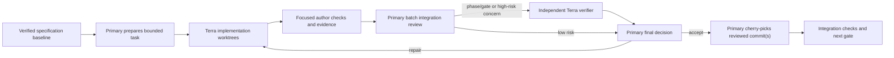
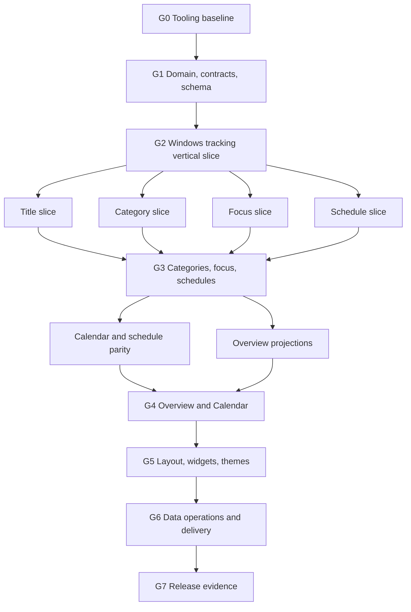

# OpenManic MVP implementation and agent-execution plan

- Status: verified execution plan; verifier corrections incorporated
- Specification baseline: `ca9d8fa`
- Primary release: Windows 11 x86-64
- Implementation agents: Terra
- Integration authority: primary agent only

## 1. Purpose

This document defines how the OpenManic MVP is implemented safely through delegated Terra-agent work. It converts the product and technical specifications into ordered, bounded work packages with explicit ownership, acceptance evidence, verification, and integration gates.

This is not a replacement for the product or technical specifications. Precedence is:

1. [Product and functional requirements](../openmanic-gui-product-requirements.md) for user-visible behavior.
2. The technical specifications in this directory for architecture and implementation behavior.
3. This plan for execution order, delegation, review, and integration.
4. An individual task brief for the narrow implementation assignment only.

If a task exposes a conflict or missing product decision, the agent stops and reports it. An implementation task may not resolve the conflict by inventing behavior.

## 2. Completion model

Terra agents author bounded changes. They do not approve architecture, integrate branches, or declare requirements complete. The primary agent:

- owns the task graph and shared contracts;
- creates task branches and worktrees;
- reviews each coherent batch integration diff and its public boundaries;
- runs focused unblock checks during assembly and the full relevant checks at its phase/gate;
- requests separate verification at a phase/gate or for a concrete high-risk concern;
- accepts, rejects, or returns work for repair; and
- performs all integration into the implementation branch.



No work is accepted because an author or verifier says it is correct. Acceptance requires reproducible evidence and the primary agent's decision.

## 3. Git and worktree model

### 3.1 Long-lived branches

- `codex/openmanic-mvp-spec-baseline` contains the verified planning baseline.
- After this plan is approved, the primary creates `codex/openmanic-mvp-implementation` from the approved plan head.
- Only the primary integrates into the implementation branch.
- The implementation branch stays buildable and passes its currently applicable gate after every accepted task.

### 3.2 Task branches

Each implementation task uses:

```text
branch:   codex/om-<task-id>-<short-name>
worktree: <absolute writable worktree root>/om-<task-id>
base:     exact integration commit SHA
```

The primary creates the branch and worktree before delegation. The task agent MUST NOT create, switch, delete, merge, push, force-push, or rebase branches unless the primary explicitly assigns that exact Git operation.

Because Codex subagents can share a filesystem and checked-out repository, two writing agents MUST NOT use the same worktree. If isolated worktrees cannot be provided, writing tasks are serialized. A branch name alone is not isolation when agents share a checkout.

### 3.3 Commit rules

- One task produces one or more small coherent commits.
- Commit subjects use the task ID and conventional scope, for example `feat(tracking): [OM-210] reduce platform evidence`.
- Agents stage only assigned paths with `git add -- <paths>`.
- `git add .`, `git add -A`, destructive resets, cleaning, and unrelated formatting are prohibited.
- Agents never amend another task's commit.
- The primary normally cherry-picks reviewed commits in dependency order.
- If integration has advanced and a task conflicts, the primary issues a new conflict-resolution task with a new base SHA. The author does not guess through a contract or migration conflict.

### 3.4 Primary-owned shared files

These are read-only to agents unless a task explicitly transfers ownership:

- Root `Cargo.toml` and `Cargo.lock`.
- `.cargo/config.toml`, toolchain, lint, formatting, dependency-policy, CI, packaging, and release configuration.
- Cross-crate feature flags and dependency versions.
- Canonical public command, event, port, and snapshot types.
- `0001_initial.sql`, the migration registry, and migration numbering.
- Product, architecture, data-model, and other canonical specification documents.

An agent that needs one of these changed reports the exact requested diff and reason. The primary either creates a dedicated shared-contract task or rejects the request.

## 4. Roles

### 4.1 Primary integrator

The primary agent is accountable for:

- keeping the integration branch clean and buildable;
- maintaining the ownership and dependency ledger;
- choosing dependency versions from measured/tested evidence;
- freezing and changing public contracts deliberately;
- assigning migration numbers serially;
- inspecting author and verifier evidence;
- running independent boundary and adversarial checks;
- deciding all waivers and specification changes; and
- signing off each integration gate and the final MVP.

### 4.2 Terra implementation agent

An implementation agent:

- works only in its assigned worktree and writable paths;
- reads every required source document before editing;
- implements one stated outcome without broadening scope;
- adds positive, boundary, negative, and recovery tests appropriate to the task;
- performs a complete base-to-head self-review;
- commits the result on its task branch; and
- returns the evidence manifest in Section 8.

It may recommend a contract change but may not apply an unapproved one. It may not delegate further unless the primary explicitly permits it.

### 4.3 Terra verifier

When the primary requests one for a phase/gate or a concrete high-risk concern, a verifier starts
read-only from the reviewed batch head. It:

- receives the relevant batch/task briefs, base/head SHAs, diff, and author evidence;
- independently maps requirements to behavior and tests;
- reruns relevant checks and searches for counterexamples;
- examines actual failure, privacy, concurrency, and recovery paths;
- reports findings with severity, exact location, and evidence; and
- does not fix the author's code.

The original author repairs findings on the same task branch. P0/P1 repairs receive another verifier
pass. The verifier advises; the primary decides.

## 5. Task sizing and ownership

A task is ready for delegation only when it has one coherent outcome, an immutable base, explicit writable paths, and testable acceptance criteria.

Normal task boundaries:

- one domain policy or state machine;
- one adapter capability;
- one repository/service contract;
- one projection or renderer;
- one screen flow backed by an already-frozen application contract; or
- one tooling/release concern.

A task is too broad when it:

- mixes unrelated product features;
- changes multiple public contracts incidentally;
- owns both a policy and every adapter/UI consumer at once;
- cannot name exact negative and recovery cases;
- would require two active agents to edit the same file; or
- contains an unspecified architectural decision.

Cross-layer vertical-slice tasks are reserved for integration after their component contracts have already passed individual review. They are always high-risk and independently verified.

## 6. Required task brief

Every implementation prompt MUST contain this information:

```text
Task ID:
Role: implementation | repair | conflict-resolution
Model: Terra
Absolute worktree:
Branch:
Immutable base SHA:

Objective:
User-visible or architectural outcome:

Canonical sources:
- exact document paths and relevant sections
- precedence if sources appear to conflict

Requirement trace:
- exact AC-nn rows and detailed product-flow rows from Section 11.1

Acceptance criteria:
1.
2.

Writable paths:
- exact files or narrow directories

Read-only dependencies:
- exact public contracts and callers to inspect

Forbidden changes:
- all non-goals
- shared files not owned
- dependency additions unless pre-approved

Required constraints:
- relevant architecture, privacy, timing, persistence, and UI rules

Required tests and checks:
- exact commands
- positive, negative, boundary, recovery, and performance cases

Commit policy:
- required subject/task ID
- no merge, rebase, push, or unrelated cleanup

Handoff:
- evidence manifest
- unresolved decisions and remaining risk
```

The prompt names outcomes rather than saying "work on" a subsystem. It includes only the specification sections needed for the task, but agents must still follow the repository-wide code-quality standard.

## 7. Mandatory agent preflight

Before editing, the agent reports:

- [ ] Absolute worktree and assigned branch match the brief.
- [ ] `HEAD` equals the assigned base SHA.
- [ ] `git status --short` is clean.
- [ ] Every applicable `AGENTS.md` has been read completely.
- [ ] Every canonical document and relevant code path named in the brief has been read.
- [ ] Every assigned AC/detail row has an explicit evidence case; no applicable MUST is silently omitted.
- [ ] Owned modules, callers, public dependencies, and existing tests have been inspected.
- [ ] Baseline targeted checks have been run and pre-existing failures recorded verbatim.
- [ ] No writable-path overlap exists with an active task.
- [ ] Any required public-contract, schema, migration, lockfile, feature, or dependency change has been identified.

If the branch, base, ownership, or document precedence is wrong, the agent stops without edits. A missing meaningful decision is escalated to the primary rather than assumed.

## 8. Evidence manifest

Every author handoff includes:

```yaml
task_id:
role:
branch:
worktree:
base_sha:
head_sha:
commits:
objective:
requirement_refs:
owned_paths:
changed_files:
public_contract_changes:
schema_or_migration_changes:
dependency_changes:
unsafe_inventory:
decisions:
assumptions:
known_limitations:
pre_existing_failures:
self_review_findings:
commands:
  - command:
    exit_code:
    duration:
    result_summary:
tests_added:
acceptance_criteria:
  - criterion:
    status: pass | fail | partial
    evidence:
performance_evidence:
privacy_and_data_handling:
remaining_risks:
git_status:
```

"Tests pass" is not evidence. The manifest names the exact command, exit code, important cases, and tested head SHA. Performance evidence also names hardware or VM, build profile, fixture seed/metadata, sample count, and p50/p95 method.

## 9. Review and verification policy

### 9.1 Primary review for each coherent batch

The primary MUST confirm task bases/heads, clean status, and path ownership before integration;
inspect the batch integration diff; and reject a concrete scope, contract, safety, or regression
concern. The primary records the batch decision and real limitations in the ledger. Full
requirement-to-evidence reconstruction and adversarial review occur at the applicable phase/gate.

### 9.2 Escalated independent verification

The primary requests a separate read-only verifier at the applicable phase/gate when a batch includes:

- domain invariants or public command/event/snapshot/port contracts;
- SQLite schema, migrations, transactions, recovery, import, backup, move, or deletion;
- unsafe Rust, Win32/FFI, window/process identity, or OS lifecycle evidence;
- threads, event ordering, bounded queues, cancellation, shutdown, suspend/resume, or clocks;
- privacy, exclusions, title collection, paths, diagnostics, or security boundaries;
- tray, autostart, single-instance activation, or crash behavior;
- frame-path or startup performance budgets;
- more than one architectural layer or implementation crate;
- a new dependency; or
- flaky behavior, data-loss regression, or repeated failed repair.

Localized documentation, test-data additions, mechanical renames, and isolated visual polish may
use primary-only review. An earlier separate verifier is required only when a concrete failure,
conflict, suspected privacy/security issue, unsafe boundary, fabricated tracking evidence, or
similar material concern is discovered; ordinary task completion alone is not a trigger.

### 9.3 Finding severity

| Severity | Meaning | Integration result |
| --- | --- | --- |
| P0 | Security/privacy breach, corruption, or data loss | Always blocks; stop related integration |
| P1 | Requirement violation, race, incorrect result, or ungraceful critical failure | Always blocks |
| P2 | Missing negative test, weak diagnostics, maintainability or avoidable performance risk | Resolve or receive explicit primary waiver |
| P3 | Local readability/style suggestion | Non-blocking unless systematic |

## 10. Global implementation rules

Every task follows these rules:

- No production `.unwrap()`, `.expect()`, `panic!`, `todo!`, `unimplemented!`, `dbg!`, or broad lint suppression.
- Assertions protect programmer invariants; expected failures use typed errors.
- Domain, application, storage, UI, and platform dependency directions remain those in [Project structure](project-structure.md).
- UI code consumes immutable correlated snapshots and emits typed actions. It performs no SQLite, platform, recurrence, import, or full-range aggregation work.
- Time-sensitive state derives from authoritative timestamps and fakeable clocks, never repaint frequency or test sleeps.
- Channels are bounded and declare overflow, coalescing, and cancellation behavior.
- Storage writes are transactional; a commit and data revision are atomic.
- No unexplained gap is labeled Powered Off.
- Window titles never identify an application or enter ordinary logs.
- Excluded applications persist only the minimum declared exclusion evidence.
- No network, telemetry, remote update, or undeclared export is added.
- New dependencies require primary approval based on purpose, transitive/native footprint, features, and why existing code is insufficient.
- An accepted/applied migration is immutable; schema changes use a new primary-assigned migration.
- Tests do not use arbitrary sleeps, live network access, or uncontrolled wall time.
- Agents do not weaken tests, lints, assertions, durability, or timeouts to obtain a pass.

## 11. Dependency and integration graph



Public application contracts freeze at G1. Later changes require a dedicated contract-change task, independent verification, and rebasing of every affected queued branch.

Migration implementation is serialized. The primary reserves each number in the task ledger before an agent edits it. Two active tasks never own the same migration or schema region.

### 11.1 Acceptance trace frozen before implementation

The following matrix is the minimum requirement-to-task assignment. `AC-nn` refers to the numbered MVP acceptance criterion in Product Requirements Section 33. Every task brief cites its applicable `AC-nn` rows and replaces the summary below with exact positive, negative, boundary, recovery, performance, or manual evidence. The primary freezes this mapping at G0; OM-740 verifies it but is not allowed to discover first-time ownership gaps.

| Acceptance | Owning tasks | Required evidence focus |
| --- | --- | --- |
| AC-01 | OM-240, OM-250, OM-299, OM-720 | Foreground intervals while visible, hidden, and minimized on real Windows. |
| AC-02 | OM-210, OM-290, OM-299 | Immediate pending/accepted pause and resume with durable state. |
| AC-03 | OM-280, OM-281, OM-282, OM-291 | Continuous aligned bands, explicit gaps and Powered Off, no in-band labels. |
| AC-04 | OM-281, OM-291 | One prompt pointer-adjacent hover box with exact value and times. |
| AC-05 | OM-281, OM-282, OM-291 | Live/history, pan, anchored zoom, reset, hover, click, and drag range selection. |
| AC-06 | OM-120, OM-330, OM-331, OM-332 | Timeline schedule creation, precise bracket, recurrence choices, overnight, and overlap rejection. |
| AC-07 | OM-330, OM-332, OM-410, OM-411, OM-412 | One authoritative schedule and all edit/delete scopes across both screens. |
| AC-08 | OM-290, OM-291, OM-292, OM-293, OM-310, OM-311 | Shared selection plus category/application actions without mutation on selection. |
| AC-09 | OM-292 | Usage totals and percentages for the exact active range. |
| AC-10 | OM-310, OM-311 | Search plus individual and bulk category assignment. |
| AC-11 | OM-400, OM-401, OM-402 | Every Overview range, shared selection, and full saved-view restoration. |
| AC-12 | OM-410, OM-411, OM-412 | Distinct Calendar sources and recorded-block navigation to timeline context. |
| AC-13 | OM-110, OM-320, OM-321 | Full focus lifecycle independent of repaint frequency. |
| AC-14 | OM-200, OM-220, OM-270, OM-280, OM-400, OM-610 | Responsive frame path while storage, import, projections, and recurrence run. |
| AC-15 | OM-200, OM-270, OM-610, OM-642 | Named concurrent jobs, progress/activity, safe cancellation, and durable failure state. |
| AC-16 | OM-500, OM-510, OM-511 | Explicit layout mode and add/remove/reorder/resize Save/Cancel/Reset behavior. |
| AC-17 | OM-510, OM-511 | Required logical-width and DPI reflow matrix without canonical-layout loss. |
| AC-18 | OM-130, OM-500, OM-510 | Versioned layout and recoverable invalid/missing-renderer fallback. |
| AC-19 | OM-270, OM-311, OM-332, OM-402, OM-411, OM-511, OM-641 | Standard egui keyboard behavior for every conventional control flow. |
| AC-20 | OM-100, OM-210, OM-260, OM-291, OM-299 | Every tracking cause explicit; no Powered Off inference from a gap. |
| AC-21 | OM-030, OM-040, OM-282, OM-291, OM-700 | Reproducible 10,000-interval p50/p95 interaction and overlay evidence. |
| AC-22 | OM-140, OM-200, OM-270, OM-280, OM-400, OM-610 | Architectural and measured proof that prohibited work stays off the egui thread. |
| AC-23 | OM-200, OM-296, OM-320, OM-643, OM-720 | Hidden services remain active; explicit Quit checkpoints, flushes, and reports failure. |
| AC-24 | Every task; OM-740 audits | No team, organization, administrator, manager, sharing, or monitoring workflow. |
| AC-25 | OM-050, OM-290, OM-291, OM-311, OM-321, OM-332, OM-640 | Ordinary-language first-use flows with no account or technical setup. |
| AC-26 | OM-250, OM-295, OM-600, OM-630, OM-641 | Discoverable exact identity/time, data location, export, advanced settings, and diagnostics. |
| AC-27 | OM-050, OM-291, OM-292, OM-293, OM-402, OM-411, OM-641 | Purposeful graphics plus precise text, structured values, and conventional corrective actions. |
| AC-28 | OM-140, OM-270, OM-280, OM-290, OM-291, OM-292, OM-293, OM-500 | Immutable correlated snapshots and action-only renderers. |
| AC-29 | OM-130, OM-520 | Versioned theme resolves atomically to standard and custom styles; invalid input preserves prior style. |

The numbered acceptance criteria do not repeat every detailed product MUST. The following high-risk flows therefore also have explicit owners and may not be left to visual polish:

| Detailed product flow | Owning tasks and minimum evidence |
| --- | --- |
| Today date navigation | OM-290 tests Previous, Next, direct date picker, one-action Today, current-day future-navigation behavior, and consistent update of every default widget. |
| Route-local state retention | OM-270 tests date/range, filters, and reasonable scroll restoration; OM-511 tests the unsaved-layout warning across navigation. |
| Timeline details and actions | OM-291 tests transient versus persistent details, exact times, non-color identification, and correct action routing; OM-310/311 test category editing and application assignment effects. |
| Application-usage interpretation | OM-292 tests sort order, totals, percentages, remaining-item aggregation, exact range labels, and empty/partial states. |
| Time-distribution interpretation | OM-293 tests grouping, totals, labels/values usable without color alone, approved compact presentation, and empty/partial states. |
| Saved-view management | OM-401/402 test create, load, rename, duplicate, reorder, and confirmed delete plus exact effective restoration. |
| Calendar controls and details | OM-411 tests Previous, Next, date picker, Today, future-navigation behavior, exact block source/time details, dense periods, and recorded-block navigation. |
| Close versus Quit | OM-296 exposes both lifecycle actions and the first hide-to-tray notice; OM-641 persists the user choice; OM-643 tests coordinated exit and flush-failure choices. |
| Destructive or irreversible actions | OM-311, OM-332, OM-401, OM-610, OM-620, OM-621, and OM-642 identify scope and require confirmation unless the action is demonstrably recoverable. |

## 12. Phase 0: repository and measurement foundation

| ID | Outcome and owned surface | Depends on | Required evidence |
| --- | --- | --- | --- |
| OM-010 | Create the six-crate workspace, pinned stable toolchain, formatter/Clippy configuration, dependency policy, `.editorconfig`, root features, and compile-safe crate roots. Root/shared files are explicitly transferred for this task. | Approved plan head | Fresh checkout builds; every member inherits workspace lints; default Windows/WGPU and Windows/Glow feature checks compile without both renderers in one artifact. |
| OM-020 | Implement `tools/xtask` with `quality`, `docs-check`, `dependency-check`, and `release-check`. Provider-specific hosted CI remains unchosen until the repository host is explicitly selected. | OM-010 | `cargo xtask quality` runs exact documented commands, never installs/fixes silently, and produces nonzero status for controlled failures. `docs-check` validates local links and rejects replacement characters and known mojibake byte patterns. |
| OM-030 | Implement deterministic fixture generator and shared test builders/fake clocks/adapters. | OM-010 | Stable seeds generate normal day, 10,000-interval range, rapid A -> B -> A, title churn, DST/overnight schedules, concurrent jobs, and slowed-UI metadata. |
| OM-040 | Build an isolated minimal native UI/measurement fixture and run the renderer/startup spike without defining product-layer contracts. Compare WGPU and Glow on artifact size, cold/warm shell, memory, driver behavior, and dense paint cost. | OM-010, OM-030 | Reproducible reference-hardware/OS/build manifest, measurement procedure, sample counts, p50/p95 results, renderer recommendation, and provisional startup, memory, artifact-size, UI-CPU, and routine-frame budgets. No runtime dual-renderer artifact. |
| OM-050 | Produce mock-snapshot low-fidelity interaction and visual-direction spikes for the five screens, timeline, widgets, errors, and progressive disclosure. Resolve the unsettled time-distribution presentation without treating spike code as production architecture. | OM-010, OM-030 | Reviewable flows at key widths, documented chart/widget choice, semantic token direction, loading/error examples, and primary/user decision before production UI tasks consume them. |
| OM-060 | Primary-owned acceptance-trace freeze: validate every AC-01 through AC-29 row and every detailed product-flow row in Section 11.1 against exact task briefs and planned evidence. | OM-050 | No unowned MUST, no task with vague "UI complete" evidence, and a ledger-ready trace reviewed before production code begins. |

### Gate G0: tooling baseline

- `cargo xtask quality` passes from a clean checkout with the pinned toolchain.
- Dependency and target features are centralized and locked.
- Forbidden crate dependency edges are absent.
- Fixtures are deterministic and usable without production network or external database setup.
- The primary records the selected renderer, reference hardware, measurement protocol, spike p50/p95 values, and approved provisional startup, memory, artifact-size, UI-CPU, and routine-frame budgets.
- The approved visual/interaction direction and distribution presentation are recorded before production screen rendering.
- OM-060 freezes requirement ownership; no acceptance mapping is deferred until final release review.

## 13. Phase 1: domain, contract, and schema freeze

| ID | Outcome and owned surface | Depends on | Required evidence |
| --- | --- | --- | --- |
| OM-100 | Domain IDs, UTC microseconds, half-open ranges, application/category values, activity states, causes, and evidence. | G0 | Property/boundary tests for positive intervals, adjacency, overlap helpers, opaque IDs, state invariants, and inability to construct Powered Off without qualifying evidence. |
| OM-110 | Focus domain state machine. | OM-100 | Planned/start/pause/resume/complete/cancel and restart-before/after-deadline tests with fake time; at most one active/paused state. |
| OM-120 | Schedule domain recurrence, exceptions, time-zone segmentation, DST rules, overnight validation, overlap, and edit scopes. | OM-100 | Gap/fold, zone change, adjacency, cross-midnight, only-this-date, this-and-future, every-occurrence, and conflict tests. |
| OM-130 | Layout, saved-view, settings, theme-selection, and versioned document value types. | OM-100 | Validation, deterministic migration/fallback, invalid-document preservation contract, and no serialized egui field names. |
| OM-140 | Freeze application command/event/job IDs, envelopes, ports, projection requests/snapshots, typed errors, and correlation/stale-result rules. Shared public paths are exclusively owned. | OM-100, OM-110, OM-120, OM-130 | Fake adapters compile against ports; serialization/schema tests; dependency graph proves UI cannot reach concrete storage/platform; every mutation has confirmation/rejection. |
| OM-150 | Implement SQLite connection/migration framework and the complete reviewed `0001_initial.sql` schema. This task exclusively owns the initial migration. | OM-100, OM-110, OM-120, OM-130, OM-140 | WAL/FULL/foreign-key/trusted-schema/query-only checks, STRICT constraints, indexes, migration checksum, newer-database refusal, and schema/data-model verifier pass. |
| OM-151 | Implement the migration safety guard used before every post-`0001` migration: SQLite online backup, verification, retained recovery path, ledger/checksum failure handling, and restore procedure. No schema change is owned. | OM-150 | A forced migration failure leaves the original database usable; backup is verified before migration starts; newer/checksum-invalid databases are refused; restore and retained-backup evidence are independently reviewed. |

OM-110, OM-120, and OM-130 may run in parallel after OM-100, using disjoint paths. OM-140, OM-150, and OM-151 are sequential contract/safety tasks and require independent verification.

### Gate G1: contracts frozen

- All domain invariants and document versions have tests.
- Public application contracts are documented and frozen at an exact SHA.
- The initial schema maps every MVP entity and passes a separate schema review.
- The pre-migration safety guard passes destructive failure-and-restore testing before any task may own a post-`0001` migration.
- No infrastructure type enters the domain and no concrete adapter enters application contracts.
- Queued adapter/UI tasks are rebased onto the frozen-contract SHA before work begins.

## 14. Phase 2: Windows tracking vertical slice

| ID | Outcome and owned surface | Depends on | Required evidence |
| --- | --- | --- | --- |
| OM-200 | Runtime primitives: bounded lanes, latest-value mailbox, cancellation, service health, named thread roots, and shutdown coordination. | G1 | Queue-full behavior, critical preservation, coalescing, cancellation idempotence, worker/fatal policies, and join-order tests. |
| OM-210 | Platform-neutral tracking reducer and service translating evidence into transactional intent/checkpoints. | OM-100, OM-140 | Cause precedence, duplicate/reordered events, rapid switches, evidence loss, unknown gaps, five-second checkpoint policy using fake time, and non-overlap tests. |
| OM-220 | Writer, read session, store revision, activity/application/category repositories, and atomic checkpoint recovery. | OM-151, OM-210 | Real temporary SQLite tests for mutation+revision atomicity, concurrent snapshot consistency, busy handling, WAL behavior, crash recovery, and no fabricated activity. |
| OM-230 | Platform capability/event normalization and a deterministic fake adapter. | OM-140 | Nonblocking sink, monotonic sequence, explicit overflow/evidence-loss behavior, availability/degradation states, and no platform handles outside the crate. |
| OM-240 | Windows control window, message loop, WinEvent foreground hook, bounded callback ingress, reconciliation, and foreground availability. | OM-230 | Raw-event tests and fixture-window integration; callback performs bounded minimal work; null/destroyed handles and overflow produce explicit uncertainty. |
| OM-250 | Windows process/application identity, PID-reuse defense, packaged/unpackaged resolution, and unresolved evidence. | OM-240 | PID+creation-time caching, AUMID/path precedence, access-denied/protected cases, hosted-app uncertainty, and no title-based identity. |
| OM-260 | Windows idle, WTS session, suspend/resume, clock discontinuity, and end-session evidence normalization. | OM-240 | Deterministic raw-message and precedence tests; sleep is not Powered Off; proposed shutdown cancellation is handled. VM/manual evidence is labeled preliminary; disruptive real shutdown/restart/hibernate coverage is reserved for OM-720. |
| OM-270 | egui shell, `UiModel`, reducers, navigation, status/loading/error states, nonblocking dispatcher, and initial dark resolved theme. | OM-140 | Pending/confirmed/rejected actions, stale snapshot rejection, ordinary keyboard behavior, preservation of route-local date/range/filter/reasonable-scroll state, and dependency search proving no storage/platform imports. |
| OM-280 | Timeline read projection, interval normalization, visible-range index, and immutable correlated snapshot contract. | OM-140, OM-220 | Exact raw interval identity, explicit unknown/no-application states, stale-request rejection, bounded visible-range query, and no frame-thread storage access or full-history clone. |
| OM-281 | Pure timeline time transform, band/schedule geometry, binary-search hit testing, and tick generation. | OM-280 | One shared transform; exact boundary/hit identity including Powered Off; adaptive non-overlapping ticks; deterministic geometry at required widths/scales. |
| OM-282 | Three-band interaction and paint kernel: one interaction response, pointer-anchored zoom, pan, click/drag selection, reset, paint-only aggregation, and schedule-overlay hooks. | OM-040, OM-050, OM-281 | Original records/totals survive aggregation; all bands/overlays move together; 10,000-interval fixture meets provisional p50/p95 budget; no per-interval egui widget allocation. |
| OM-290 | Today screen controller with date navigation, tracking controls, shared range/filter selection, and a fixed bootstrap registry containing the three default widget instances. This is not the extensible/configurable registry completed by OM-500. | OM-050, OM-270, OM-280 | Previous/Next/date-picker/one-action Today and current-day future-navigation behavior; every default widget receives the same context; active narrowing criteria can be cleared; tracking actions acknowledge by the next frame. |
| OM-291 | Three-band timeline renderer and transient/persistent detail panel consuming OM-281/282 geometry and OM-290 state. | OM-282, OM-290 | Continuous gap-explicit bands; no in-band text; exact single hover box; non-color identification; persistent selection; correct category/application action routing without mutation on selection. |
| OM-292 | Application-usage widget renderer consuming immutable Today snapshots. | OM-290 | Deterministic sort, exact totals/percentages, selected-range label, remaining-item aggregation, and loading/empty/partial/error states without renderer port access. |
| OM-293 | Approved time-distribution widget renderer consuming immutable Today snapshots. | OM-050, OM-290 | Correct grouping/totals, exact values and labels independent of color, approved compact presentation, and loading/empty/partial/error states without renderer port access. |
| OM-295 | Bootstrap, CLI, artifact-adjacent data-root selection, locator, data lock, minimal diagnostics/panic hook, and first-launch state. | G1 | Resolution precedence, unwritable/default chooser, local/writable/lockable validation, network-share rejection, privacy-safe diagnostics. |
| OM-296 | Windows tray/control actions, close-to-tray notice, single-instance mutex/pipe activation, and data-root writer protection. | OM-200, OM-240, OM-295 | Second launch activates existing process or flashes fallback; Explorer restart restores tray; close hides without stopping services; user-scoped access. |
| OM-299 | Primary-owned integration task composing the first end-to-end Windows vertical slice across accepted contracts. | OM-200, OM-210, OM-220, OM-230, OM-250, OM-260, OM-290, OM-291, OM-292, OM-293, OM-295, OM-296 | Real Windows test: track visible/minimized/hidden/stalled UI, pause/resume, persist and restart, display live/historical timeline and both summary widgets, and perform coordinated explicit Quit. |

After G1, OM-200, OM-210, OM-230, OM-270, OM-280, and OM-295 may begin in isolated worktrees where dependencies permit. OM-240 -> OM-250/260, OM-280 -> OM-281 -> OM-282, and OM-270/280 -> OM-290 -> OM-291/292/293 remain ordered. OM-299 is primary-owned and high-risk.

### Gate G2: Windows vertical slice

- Hidden, minimized, resized, or deliberately stalled UI does not stop tracking.
- Tracking history survives restart and uncertainty is labeled honestly.
- Pause/resume acknowledgement is visible by the next normal frame.
- The UI performs no storage/platform/full-history work.
- The timeline uses one interaction response and meets the G0 provisional dense-fixture p50/p95 budget.
- Today date controls, usage totals, distribution totals, tooltip/detail behavior, and shared narrowing state pass their explicit AC mappings.
- SQLite is WAL/FULL with one writer and short reader transactions.
- Tray, single instance, data root, and explicit Quit work on Windows 11.
- All cross-layer and platform work has independent verification.

Broad feature implementation does not begin until G2 passes on a real Windows environment.

## 15. Phase 3: titles, categories, focus, and schedules

| ID | Outcome and owned surface | Depends on | Required evidence |
| --- | --- | --- | --- |
| OM-300 | Title stabilizer, deduplicated/bounded title spans, Windows title observation, and collection setting enforcement. | G2, OM-313 | 10/50/100 changes per second do not create applications/activity intervals; approximately two-second stability; 2 KiB bound; consecutive coalescing; no ordinary logging; disabled/excluded behavior. |
| OM-310 | Category/application service, repository, create/rename/delete commands, historical projection invalidation, search/filter, and bulk assignment. | G2 | One category per application; rename preserves assignments; deletion returns apps to Uncategorized; assignment changes historical projections without rewriting activity; selection alone never mutates; destructive scope is explicit and confirmed when not recoverable. |
| OM-312 | Background application metadata and bounded icon cache/extraction with deterministic fallback. | G2, OM-250 | No UI-thread filesystem/OS work; icons keyed once per application/digest; decode failure uses fallback; cache byte/entry bounds and privacy-safe diagnostics. |
| OM-313 | Excluded-application policy across application commands, persistence, tracking reducer, projections, and privacy minimization. | OM-210, OM-310 | Excluding the active app closes trusted attribution promptly; new periods persist only declared Excluded evidence; no title/detail capture; disabling exclusion resumes from fresh observation without rewriting history. |
| OM-311 | Categories screen and category-edit flows using OM-310 snapshots/actions, OM-312 icon results, and OM-313 exclusion status. | OM-310, OM-312, OM-313 | Search by name/identity, category/uncategorized filters, exclusion status, individual/multi-select/bulk assignment/removal, create-during-assignment without lost selection, category editing and application assignment routed from Timeline details, loading/error/retry, confirmation for destructive scope, and ordinary keyboard behavior. |
| OM-320 | Focus service, repository, restart reconciliation, projection, and notification port behavior. | G2, OM-110 | Absolute deadline accuracy while hidden/stalled; pause remainder; restart before/after deadline; one active/paused session; typed notification failure. |
| OM-321 | Pomodoro/focus widget, overlays, tray actions, notification/sound settings, and user-visible completion/cancellation states. | OM-320 | Required controls/states, no repaint-dependent timekeeping, focus distinct from activity/schedule, hide/restore behavior, and graceful notification/sound failure. |
| OM-330 | Schedule repository/service for once, weekday/custom recurrence, authoritative overlap validation, exceptions, and edit scopes. | G2, OM-120 | Adjacency accepted; overlaps rejected; overnight and DST rules; edit-scope lineage; mutation reconciliation and revision atomicity. |
| OM-331 | Schedule occurrence projection and exact bracket overlays sharing the timeline transform. | OM-330, OM-282 | Same coordinate transform, dense adjacent brackets, adjusted-occurrence marker, no mutation of recorded activity. |
| OM-332 | Timeline create/edit gesture mode and shared schedule editor dialog. | OM-331 | Provisional exact times, positive cross-midnight duration, save/reject reconciliation, only-this/this-and-future/every-occurrence edit/delete choices. |

OM-310, OM-312, OM-320, and the non-UI portion of OM-330 may proceed concurrently after G2 in disjoint worktrees. OM-313 follows OM-310, and privacy-sensitive OM-300 follows OM-313. Schedule tasks remain OM-330 -> OM-331 -> OM-332.

### Gate G3: core feature behavior

- Title churn remains bounded and privacy-safe.
- Categories propagate consistently to timeline and summaries.
- Focus timing is correct across hide, stall, sleep evidence, and restart.
- Schedule recurrence/edit scopes pass temporal property tests.
- Timeline schedule creation and overlays use the same authoritative service and coordinate transform.
- Each feature passes its service -> persistence -> projection -> UI integration tests.

## 16. Phase 4: Overview and Calendar

| ID | Outcome and owned surface | Depends on | Required evidence |
| --- | --- | --- | --- |
| OM-400 | Range/filter/shared-selection model plus cancellable Overview projections and cache keys. | G3, OM-310 | Day/week/month/year/custom boundaries, progressive prior-data behavior, stale/cancelled results never overwrite current context. |
| OM-401 | Saved-view repository/service and versioned restoration contract. | OM-400, OM-130 | Create/load/rename/duplicate/reorder/confirmed-delete commands; range/grouping/filter/sort/config restoration; revision conflict behavior; invalid-document fallback; deterministic ordering. |
| OM-402 | Overview UI and approved allocation/usage/distribution presentation consuming OM-400/401 snapshots. | OM-050, OM-400, OM-401 | Correct totals/percentages and exact range; shared selection; create/load/rename/duplicate/reorder/confirmed-delete saved-view flows; loading/partial/error states without port access. |
| OM-410 | Calendar day projection for tracked activity, focus, and schedule occurrences. | G3, OM-320, OM-330 | Local-day boundaries including DST, stable IDs, overlap data, and activity-to-timeline navigation context. |
| OM-411 | Calendar day UI and recorded-block navigation consuming OM-410 snapshots. | OM-410 | Visually distinct activity/focus/schedule overlays; Previous/Next/date-picker/Today controls and current-day future-navigation behavior; exact selected-block source/time details; dense-period navigation; recorded-block route to matching timeline context; loading/empty/error states; no second data model. |
| OM-412 | Calendar schedule create/edit/delete parity using the OM-332 editor and OM-330 service. | OM-411, OM-332 | Same occurrence IDs, commands, validation, scopes, and results from Timeline and Calendar; no second schedule editor or service. |

OM-400/401/402 and OM-410/411 may proceed as two parallel ordered chains. OM-412 follows both the accepted Calendar surface and Timeline editor contract.

### Gate G4: analytical and calendar completeness

- Overview ranges and saved views meet the product flows.
- Large projections are cancellable, progressive, and revision-correlated.
- Calendar/Timeline schedule parity is proven by shared contract tests.
- A Calendar activity selection navigates to matching timeline context.

## 17. Phase 5: widgets, layouts, themes, and settings

| ID | Outcome and owned surface | Depends on | Required evidence |
| --- | --- | --- | --- |
| OM-500 | Complete first-party widget definitions, registry, versioned configurations, and missing-renderer fallback. | G4, OM-290 | No Today mega-match; stable kind/instance IDs; config migration; unavailable renderer does not prevent startup. |
| OM-510 | Layout service/repository, canonical desktop placement, validation, and deterministic reflow algorithm. | OM-500, OM-130 | Save/Cancel/Reset atomicity, invalid-document quarantine/fallback, canonical layout unchanged by viewport reflow. |
| OM-511 | Explicit layout-edit UI: add/remove/reorder/resize, compact/expanded presentation, responsive previews. | OM-510 | Save/Cancel/Reset and unsaved-navigation warning; 720/1024/1440 logical widths and 125/150/175/200 percent scaling; no lost arrangement; controls remain usable. |
| OM-520 | Complete theme resolution/migration, dark/light/system built-ins, atomic egui/custom-paint application, and appearance/settings UI. | G4, OM-130, OM-270 | Invalid theme preserves prior complete revision; no partial apply; one resolved revision styles standard and custom drawing. |

OM-500/510/511 are sequential because they share registry/layout contracts. OM-520 may proceed in parallel using isolated theme paths after its public value contract is frozen.

### Gate G5: customization completeness

- Widget registry and configuration migrations are stable.
- Layout Save/Cancel/Reset and responsive reflow pass every required size/scale matrix case.
- Invalid layout, missing renderer, and invalid theme recover without blocking startup.
- Dark/light/system themes apply atomically across egui and custom renderers.

## 18. Phase 6: data operations, recovery, and delivery

| ID | Outcome and owned surface | Depends on | Required evidence |
| --- | --- | --- | --- |
| OM-600 | Streaming CSV activity/application/category export with explicit range/destination/title disclosure. | G5 | RFC 3339 UTC, stable interchange IDs, bounded memory, privacy confirmation, deterministic rows/totals against the source fixture. |
| OM-610 | Streaming staged import, validation, persisted job/batch state, cancellation, exact committed-scope reporting, and idempotent self-reimport. Import tables are reserved in `0001`; this task owns no schema or migration change. | OM-600, OM-151 | Row-numbered failures, untrusted row-ID remap, cancellation before/during merge, explicit destination/range/scope, and no partial hidden success. A discovered schema need blocks for a separately assigned protected migration. |
| OM-620 | User-initiated online backup/restore plus quick/foreign-key verification, reusing the already accepted OM-151 safety machinery. | G5, OM-151 | Full entity restore, newer-schema refusal, retained source/backup, no raw copy of a live database, explicit restore scope, and confirmation before destructive replacement. |
| OM-621 | Coordinated verified data-directory move and atomic locator switch. | OM-620, OM-295 | Quiesce/checkpoint/close/copy/verify/reopen sequence; source preserved until success; explicit source/destination and confirmation; insufficient-space/lock/copy/verification failure paths. |
| OM-630 | Autostart repair, tray lifecycle hardening, manual update messaging, and privacy-safe diagnostic bundle controls. | G5, OM-296 | Correctly quoted current path, moved-executable repair, no network update, no raw titles, Explorer restart, and user-visible platform limitations. |
| OM-635 | Primary-owned portable Windows release integration: resources, build profile, feature selection, packaging configuration, and artifact metadata. If implementation is delegated, the brief explicitly and exclusively transfers the named root `Cargo.toml`, `Cargo.lock`, resource, and release-config paths for this serialized task. | OM-630, OM-040 | Primary reviews every dependency/feature/lockfile/resource change; normal artifact excludes dev tools and unused platform/renderer stacks, bundles SQLite, and records renderer/toolchain/lockfile identity. |
| OM-640 | First-launch/onboarding presentation for local tracking consent, title-collection default, data location, pause/disable actions, platform capability/remediation, and no-account start. | OM-260, OM-295, OM-299 | Plain-language acceptance or settings review; tracking is not shown active before confirmation; unavailable access has recovery guidance; local/offline and data-location language; no technical setup required. |
| OM-641 | Settings and privacy presentation for tracking start, autostart, Close behavior, pause, idle policy, exclusions, titles, data location, import/export, theme/density, focus notifications/sounds, and advanced diagnostics/capabilities. | G5, OM-300, OM-313, OM-520, OM-621, OM-630 | Every setting persists through its authoritative command; sensitive implications are explicit; disabling titles is prospective; Close choice persists; exact technical details remain discoverable without dominating defaults; ordinary keyboard behavior. |
| OM-642 | Recoverable loading/empty/partial/error and concurrent-job presentation, including progress/activity, Cancelling, retry/dismiss, result scope, and destructive-action confirmation components. | OM-610, OM-620, OM-621, OM-630 | Multiple named job IDs remain distinguishable after navigation; no false success; failures remain discoverable; scope is stated before destructive actions; recoverable prior content is retained. |
| OM-643 | Graceful-shutdown and Close-versus-Quit presentation wired to accepted lifecycle services. | OM-200, OM-220, OM-296, OM-320, OM-630 | Close follows the persisted choice and first tray hide is explained; Quit stops nonessential jobs, checkpoints activity/focus, flushes critical writes, joins services, and exposes Retry/Quit Anyway on flush failure. |

OM-610/620 own no schema change. Any discovered post-`0001` need becomes a separate, primary-numbered migration task that depends on OM-151 and passes its backup/restore guard before application. Import, backup, restore, and move tasks are independently verified before integration.

### Gate G6: product-complete candidate

- All 29 product acceptance criteria have requirement -> task -> automated/manual evidence mappings.
- Import/export, backup/restore, data move, first launch, settings, tray, autostart, jobs/errors, destructive confirmations, and shutdown failure paths pass.
- No normal operation requires an account, network, database server, installer, or runtime outside the portable artifact.
- All privacy and permanent-retention rules remain intact.

## 19. Phase 7: performance, reliability, and release evidence

| ID | Outcome and owned surface | Depends on | Required evidence |
| --- | --- | --- | --- |
| OM-700 | Complete release instrumentation and regression harnesses for the startup, frame/UI CPU, projection, writer, queue, WAL, memory, cache, and artifact budgets provisionally frozen at G0. | G6 | Re-run and reconcile the G0 reference-hardware manifest; sample counts and p50/p95; approved thresholds or explicit product exception; no diagnostic-only result represented as release evidence. |
| OM-710 | Fault/recovery campaign: writer/query/platform failure, queue overload, slow reader, corrupt/invalid documents, abrupt termination, cancelled shutdown, and migration/import/move failures. | G6 | No false success, fabricated activity, silent loss, or unrecoverable partial move; expected degraded/fatal states visible. |
| OM-720 | Windows 11 real-environment matrix: foreground fixtures, elevated/protected cases, Explorer restart, lock/unlock, sleep/hibernate, shutdown/restart, display scaling, and abrupt kill. | OM-700, OM-710 | Recorded environment and outcomes; explicit non-guarantees retained; mocked results are not substituted for OS evidence. |
| OM-730 | Produce and test the Windows x86-64 portable artifact on a clean Windows 11 machine/location. | OM-720, OM-635 | Beside-executable data default, user-selected directory, bundled SQLite, no runtime install, one renderer/platform family, manual replacement update. |
| OM-740 | Verify the G0-frozen requirement trace, run quality/dependency/release gates, review known risks, and produce the MVP sign-off recommendation. It may not assign previously unowned requirements. | OM-730 | Every frozen AC/detail row has exact integration-SHA evidence; `cargo xtask release-check`, dependency check, all test matrices, benchmark report, artifact hash/size, and zero unresolved P0/P1. Primary makes final release decision. |

### Gate G7: Windows MVP release

The primary may declare the MVP complete only when:

- all prior gates are recorded against exact integration SHAs;
- `cargo xtask quality`, dependency, feature, release, and platform checks pass;
- approved p95 budgets and 10,000-interval interaction tests pass on named hardware;
- a clean Windows 11 system runs the portable artifact without additional runtime setup;
- recovery and privacy evidence has no unresolved P0/P1 finding;
- every accepted waiver is explicit, bounded, and user-visible where necessary; and
- the primary has inspected the final integration diff and release evidence.

## 20. Parallelism rules

Safe parallelism means isolated worktrees, disjoint writable paths, and frozen read-only contracts. It does not mean merging simultaneously.

Permitted examples:

- OM-110, OM-120, and OM-130 after OM-100.
- OM-200, OM-210, OM-230, OM-270, OM-280, and OM-295 after G1 where their exact dependencies are satisfied.
- OM-310, OM-312, OM-320, and schedule-domain/service preparation after G2; OM-313 then OM-300 remain ordered for privacy.
- Overview and Calendar projections after G3.
- Theme completion in parallel with sequential layout tasks after G4.

Always sequential:

- workspace/shared dependency changes;
- public command/event/snapshot/port changes;
- migration numbers and shared schema changes;
- OM-150 -> OM-151 before any post-`0001` migration task;
- OM-240 before OM-250/260;
- schedule service before Timeline editor before Calendar parity;
- registry before layout persistence before layout-edit UI;
- task integration into the implementation branch; and
- release artifact creation after the real Windows verification matrix.

If a supposedly parallel task discovers a shared-contract need, it stops. The primary integrates a dedicated contract change first and supplies new bases to affected tasks.

## 21. Agent self-review checklist

Before handoff, the author completes the applicable focused checks named in the batch brief. Full
quality and platform evidence are phase/gate responsibilities, not automatic per-task work. The
following checklist remains required when its item is relevant to the assigned change or explicitly
requested by the primary:

### Repository

- [ ] `git diff --check <base>...HEAD` passes.
- [ ] `git status --short` is clean.
- [ ] Every changed path is assigned.
- [ ] No cache, generated database, log, secret, or unrelated file is committed.
- [ ] Commit history is coherent and carries the task ID.

### Rust and tests when applicable

- [ ] Formatting, targeted check, Clippy with `-D warnings`, and targeted tests pass.
- [ ] Relevant feature/target combinations compile.
- [ ] Changed code has been searched for unsafe, unwrap/expect/panic, debug macros, and unresolved TODO/FIXME.
- [ ] Positive, boundary, failure, cancellation, and recovery cases exist as applicable.
- [ ] Handles, threads, subscriptions, transactions, locks, and temporary files release on every exit.

### Architecture and product

- [ ] No egui/winit type leaked below the UI adapter boundary.
- [ ] No blocking platform/storage/aggregation work entered the frame path.
- [ ] Commands, events, snapshots, IDs, and revisions remain correlated.
- [ ] Queue, cancellation, stale-result, shutdown, and error behavior is explicit.
- [ ] UTC, monotonic time, local-zone presentation, and uncertainty remain correct.
- [ ] Writes are atomic and recovery is tested.
- [ ] Titles, exclusions, paths, logs, and exports preserve privacy rules.
- [ ] User-facing language does not expose implementation terminology unnecessarily.

## 22. Integration procedure

For each coherent batch:

1. Freeze and record every author head SHA and concise evidence manifest.
2. Inspect assigned paths and integration diffs before cherry-picking atomic commits in dependency order.
3. Return a concrete conflict, regression, missing contract, or safety concern to a bounded repair task.
4. Run only the focused checks needed to unblock the batch while it is being assembled.
5. At the applicable phase/gate, run full workspace quality, the relevant feature/platform checks,
   and one targeted read-only review.
6. Record the batch/task heads, integration SHAs, gate verdict, primary decision, and remaining
   risks in the ledger.
7. Retain task worktrees only while they are active or awaiting batch integration; then remove them
   through the primary.

An earlier independent review is required for suspected corruption, privacy leak, unsafe
unsoundness, fabricated tracking time, or another concrete high-risk boundary. It is not required
solely because an ordinary task is ready to integrate.

Never merge another task to conceal a failed integration check. A conflict or regression returns to a bounded repair task.

## 23. Failure and blocker handling

Failures are classified as:

- pre-existing baseline failure;
- task-introduced regression;
- environment/toolchain/sandbox failure;
- specification ambiguity;
- ownership or public-contract conflict;
- integration conflict; or
- flaky/non-reproducible behavior.

Agents do not fix unrelated baseline failures. They record exact reproduction and stop when the failure blocks their acceptance criteria.

After two materially different failed implementation approaches, or immediately when new product authority/architecture is required, the agent returns a blocked manifest with evidence and options. It does not repeat the same approach or silently reduce the requirement.

Suspected corruption, privacy leak, unsafe unsoundness, or fabricated tracking time stops related integration immediately and requires a separate verifier.

Flaky-test quarantine requires primary approval, a reproduction, an owner, and a remediation task. Disabling or weakening the test is not an implementation fix.

## 24. Decision, ledger, and traceability records

OM-010 creates a lightweight implementation record:

```text
docs/gui/implementation/
|-- task-ledger.md
`-- decisions/
    `-- README.md
```

The ledger records:

```text
task ID
objective
requirements/spec sections
base/head branch SHAs
writable paths
public contracts or migrations touched
author evidence
verifier findings/verdict when required
primary decision
integration SHA
remaining risk or waiver
```

Only durable architectural or product deviations get a short decision record. Ordinary code choices remain in rustdoc, tests, and commit history. Evidence logs and generated benchmark artifacts are stored outside source control unless the release specification explicitly requires a compact committed report.

## 25. Definition of done

A task is done only when:

- scope and path ownership were respected;
- every acceptance criterion has concrete evidence;
- author self-review is complete;
- all focused checks required by the batch brief pass at the reported head SHA, and the applicable
  phase/gate checks pass at the resulting integration SHA;
- independent verification has no unresolved P0/P1 finding where required;
- the primary reviewed the implementation, not only the summary;
- accepted commits are integrated in dependency order;
- checks pass at the resulting integration SHA; and
- remaining P2/P3 issues are fixed, explicitly waived, or scheduled by the primary.

A phase is done only when its gate passes. The MVP is done only at G7. Feature completeness, verifier approval, a green unit-test subset, or a successful build alone is insufficient.

## 26. Deferred NixOS follow-on

NixOS implementation is not part of the Windows MVP task graph. The platform-neutral contracts and target features preserve the adapter boundary, but NixOS work begins only after G7 unless the user explicitly changes priority.

The follow-on order is:

1. Stock NixOS 26.05/Sway 1.11 capability and packaging spike without a flake-required workflow.
2. Direct Sway IPC adapter with reconnect/capability tests.
3. Session/idle/suspend evidence integration and declared capability gaps.
4. Best-effort true-X11 EWMH adapter, explicitly distinct from Xwayland limitations.
5. Portable packaging decision and clean-system verification.

Generic Wayland, GNOME, KDE, and Hyprland support remain unclaimed.

## 27. First execution sequence

After the user approves this plan, the primary:

1. Commits the verified plan.
2. Creates `codex/openmanic-mvp-implementation` from that commit.
3. Creates the implementation ledger.
4. Dispatches OM-010 alone because it owns shared workspace files.
5. Reviews and verifies OM-010, then integrates it.
6. Dispatches OM-020 and OM-030 in isolated worktrees if available.
7. Dispatches OM-040 and OM-050 after their fixture prerequisites are available.
8. Records the renderer, provisional performance budgets, and visual-direction decisions.
9. Completes primary-owned OM-060 and freezes every acceptance/detail mapping into the ledger.
10. Runs G0 before any product implementation task.

This sequence establishes the quality machinery before Terra agents create production code and provides an exact, clean base for every subsequent assignment.
