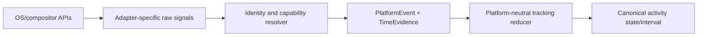
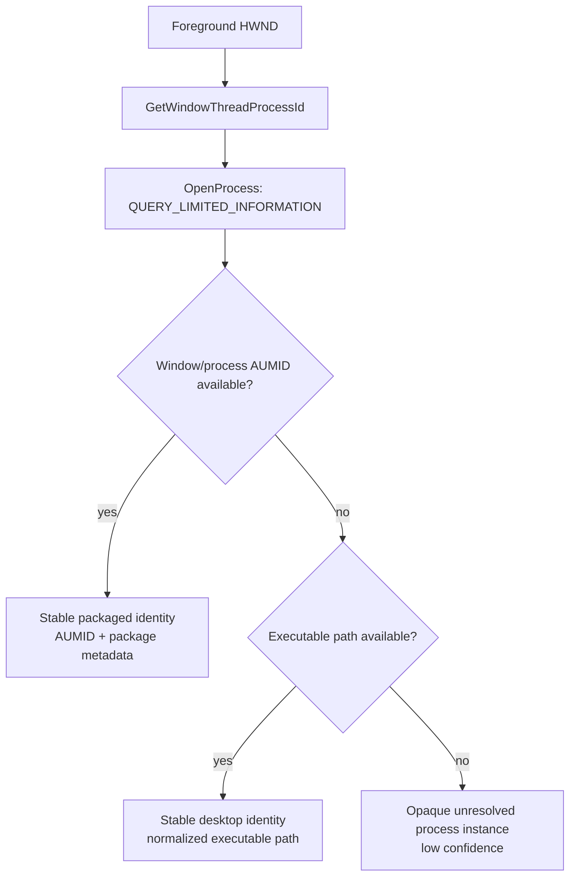

# OpenManic platform-adapter specification

## 1. Purpose

This document defines how OpenManic discovers platform capabilities and converts operating-system focus, idle, session, power, and clock evidence into platform-neutral events.

The adapter observes evidence. It does not create canonical activity intervals, query SQLite, decide category assignment, or depend on egui.

Windows 11 x86-64 is the MVP target. NixOS follows the Windows release and begins with a deliberately narrow compositor target.

## 2. Adapter boundary



Only the final two boxes are platform-neutral. Raw handles, Win32 error codes, Sway container IDs, and X11 window IDs remain inside the platform crate except as opaque diagnostic evidence.

## 3. Capability model

Support is not one Boolean. Every adapter reports individual capabilities after probing the running environment.

```rust
struct PlatformCapabilities {
    delivery: DeliveryCapability,
    focus_scope: FocusScope,
    application_identity: FieldSupport,
    window_instance: FieldSupport,
    title: FieldSupport,
    process_identity: FieldSupport,
    executable_path: FieldSupport,
    idle: FieldSupport,
    session_lock: FieldSupport,
    suspend_resume: FieldSupport,
    shutdown_evidence: FieldSupport,
    tray: FieldSupport,
    autostart: FieldSupport,
    notifications: FieldSupport,
    helper_requirement: HelperRequirement,
    permission_model: PermissionModel,
}

enum AdapterAvailability {
    Ready,
    Degraded { missing: Vec<Capability> },
    PermissionRequired,
    HelperRequired,
    TemporarilyUnavailable,
    Unsupported,
}
```

Adapter selection MUST use actual capability probes—available Win32 calls, Sway socket/version handshake, Wayland globals, or X11 EWMH properties—not only the operating-system name or desktop environment variable.

## 4. Platform event contract

```rust
trait PlatformActivityAdapter: Send + 'static {
    fn probe(&self) -> Result<PlatformProbe, AdapterError>;

    fn run(
        self: Box<Self>,
        sink: Arc<dyn PlatformEventSink>,
        stop: StopToken,
    ) -> Result<(), AdapterFatal>;
}

trait PlatformEventSink: Send + Sync {
    fn try_publish(&self, event: PlatformEvent) -> PublishResult;
}

struct PlatformEvent {
    schema_revision: u16,
    sequence: u64,
    time: TimeEvidence,
    source: EvidenceSource,
    kind: PlatformEventKind,
}

struct TimeEvidence {
    wall_utc: UtcInstant,
    monotonic_ticks: MonotonicTicks,
    sleep_excluding_ticks: Option<MonotonicTicks>,
    uncertainty: Duration,
}
```

`try_publish` is nonblocking. A full ingress queue MUST set an evidence-loss marker and force reconciliation; it MUST NOT wait inside an OS callback.

### 4.1 Event kinds

```rust
enum PlatformEventKind {
    AdapterStateChanged(AdapterState),
    ForegroundObserved(ForegroundObservation),
    ForegroundUnavailable(ForegroundUnavailableReason),
    TitleObserved(TitleObservation),
    IdleChanged { idle: bool, threshold: Duration },
    SessionChanged(SessionState),
    PowerChanged(PowerState),
    ClockDiscontinuity(ClockDiscontinuity),
    EndSession { phase: EndSessionPhase, cause: EndSessionCause },
    EvidenceLost(EvidenceLoss),
}
```

Each event carries a monotonically increasing adapter sequence. Sequence gaps are diagnostic evidence; the reducer still relies on explicit `EvidenceLost` and a fresh observation.

## 5. Windows 11 adapter

### 5.1 Execution model

One dedicated named thread owns:

- An invisible normal top-level Win32 control window.
- The Win32 message loop.
- Foreground and optional name-change event hooks.
- Reconciliation and idle timers.
- WTS session notifications.
- Suspend/resume and clock-change notifications.
- End-session messages.
- The notification-area icon and tray menu callbacks.

It MUST use a normal hidden top-level window, not a message-only `HWND_MESSAGE` window, because message-only windows do not receive all broadcast messages required for power/session lifecycle.

The eframe/winit viewport is not the platform observation window. Tracking continues when the GUI viewport is hidden, minimized, stalled, or being recreated.

### 5.2 Foreground detection

Primary mechanism:

```text
SetWinEventHook(
    EVENT_SYSTEM_FOREGROUND,
    EVENT_SYSTEM_FOREGROUND,
    WINEVENT_OUTOFCONTEXT
)
```

Requirements:

- The installing thread has a message loop.
- Do not set `WINEVENT_SKIPOWNPROCESS`; OpenManic itself must be observable.
- The callback copies only the event kind, HWND, source event tick, and a newly sampled receive time into a preallocated bounded ingress buffer.
- The callback performs no process query, title read, database write, logging of sensitive values, allocation-heavy work, or wait.
- Treat callbacks as potentially reentrant.
- Resolve the observation after returning to normal control-loop work.

Reconciliation:

- Call `GetForegroundWindow` on adapter startup.
- Reconcile after unlock, resume, hook reinstall, or detected evidence loss.
- Poll approximately once per second as a health/recovery heuristic.
- If polling disagrees with the last observation, publish a recovery observation with explicit uncertainty.
- Do not invent a midpoint or claim exact timing for transitions missed between polls.

`GetForegroundWindow` may temporarily return null. If the handle is null, destroyed before resolution, or cannot be resolved after one fresh-current-window retry, publish `ForegroundUnavailable` rather than extending the prior application.

### 5.3 Evidence overflow

If the foreground ingress buffer fills:

1. Set an atomic overflow flag.
2. Preserve already queued entries.
3. On control-loop recovery, publish `EvidenceLost`.
4. Immediately query the current foreground window.
5. Let the canonical reducer represent the uncertain period as `UnknownMissing`.

The specification does not promise complete sub-second history during overload.

### 5.4 Process and application identity

Resolution flow:



Useful APIs:

| Need | Windows API |
| --- | --- |
| Window to process | `GetWindowThreadProcessId` |
| Executable identity | `QueryFullProcessImageNameW` |
| Process creation time/PID reuse defense | `GetProcessTimes` |
| Process AUMID | `GetApplicationUserModelId` |
| Package metadata | `GetPackageFamilyName` |
| Window AUMID | `SHGetPropertyStoreForWindow` and `System.AppUserModel.ID` |
| Window caption | `GetWindowTextW` |

Policy:

- Prefer an explicit window/process AUMID for packaged/application-mode identity.
- Treat package family as metadata/fallback rather than duplicating the AUMID’s package identity.
- Use normalized executable path for ordinary unpackaged desktop software.
- Cache resolution by `(PID, process_creation_time)`, never PID alone.
- Preserve the original path for display/diagnostics.
- Use Windows-aware normalization; do not naïvely Unicode-lowercase arbitrary paths.
- A moved executable may initially appear as a new identity. A future user-assisted merge may attach both identities to one application.
- A title, filename alone, HWND, or PID is never the stable application key.
- Access denied/protected/system processes remain explicit unresolved/system observations.
- Do not request elevation, `SeDebugPrivilege`, DLL injection, UIAccess, or input hooks.

Hosted packaged windows can be ambiguous. A bounded documented heuristic may inspect a unique packaged child window/process and mark the result `hosted_window_heuristic`. Undocumented shell resolver APIs MUST NOT be used. The UI must be able to show low-confidence attribution.

### 5.5 Window titles

When title collection is enabled:

- Install a narrowly filtered `EVENT_OBJECT_NAMECHANGE` hook or reconcile title on current-window observations.
- Accept only the current foreground root window’s window-name change.
- Do not read arbitrary controls or browser content.
- Read caption text with `GetWindowTextW`.
- Send observations to the application title stabilizer.
- Do not make title changes foreground/application boundaries.

The application-layer persistence policy is defined in [Data model](data-model.md): approximately two seconds of stability, 2 KiB maximum persisted UTF-8, deduplication, coalescing, and separate title spans.

### 5.6 Idle

Use `GetLastInputInfo` approximately once per second.

- It is session-specific.
- Its tick value is evidence, not guaranteed perfectly monotonic input history.
- On a trustworthy threshold crossing, derive the boundary at the configured threshold.
- Otherwise clamp the boundary to the observation window and attach uncertainty.
- Synthetic or unusual raw input behavior must not create a negative duration.

Idle evidence is subordinate to explicit pause, lock, suspend, and adapter-unavailable states in the canonical reducer.

### 5.7 Session lock and connection

Register the hidden control window with `WTSRegisterSessionNotification` and handle `WM_WTSSESSION_CHANGE` for:

- Lock/unlock.
- Connect/disconnect.
- Logon/logoff where delivered.

On unlock/reconnect, perform a fresh foreground reconciliation before returning to Active.

### 5.8 Suspend, resume, and clock evidence

Handle `WM_POWERBROADCAST` and/or `RegisterSuspendResumeNotification`.

- Windows power broadcasts do not reliably distinguish sleep from hibernation.
- Store the state as `Unavailable` with cause `SystemSuspended`.
- Reconcile foreground and time bases after resume.

Sample together where available:

- Precise UTC with `GetSystemTimePreciseAsFileTime`.
- QPC monotonic ticks.
- `QueryUnbiasedInterruptTimePrecise`, which excludes suspended time.

Use differences to detect wall-clock discontinuity and missed low-power evidence. Rebaseline after `WM_TIMECHANGE`.

The WinEvent callback’s `dwmsEventTime` is useful for event ordering/latency correlation but is not a documented UTC epoch and MUST NOT be persisted as the canonical wall timestamp.

### 5.9 Shutdown and Powered Off

Handle:

- `WM_QUERYENDSESSION` as a proposed shutdown/logoff that may be cancelled.
- `WM_ENDSESSION(TRUE)` as confirmed session ending.

On query, queue a high-priority checkpoint request and return promptly. On confirmed end, publish end-session evidence and permit only a bounded final flush.

Windows cannot always distinguish shutdown from restart or provide exact off/start boundaries. OpenManic marks `PoweredOff` only when the evidence chain is strong enough. Otherwise the gap is `UnknownMissing`. Sleep/hibernate is never relabeled Powered Off.

### 5.10 Tray, startup, and local activation

Use direct Win32 APIs through `windows-rs` for the Windows MVP:

- `Shell_NotifyIconW` for notification-area presence.
- Re-add the icon after Explorer/taskbar recreation.
- `HKCU\Software\Microsoft\Windows\CurrentVersion\Run` for optional login start with a correctly quoted executable and `--background`.
- Current-user-ACL named mutex and named pipe for one-instance activation.
- Data-directory exclusive lock as final writer protection.

The tray menu emits typed application actions; it does not mutate services directly.

Windows may suppress notifications, delay/disable startup entries, or deny forced foreground activation. These are explicit non-guarantees.

## 6. Windows adapter availability

The UI distinguishes:

```text
Starting
Ready
DegradedIdentity
TemporarilyUnavailable
PermissionOrAccessLimited
EvidenceLost
Fatal
Stopping
```

Access failure for one elevated/protected application is a degraded observation, not a reason to ask the user to run OpenManic as administrator.

## 7. Future NixOS adapter

NixOS is post-Windows. The target is intentionally explicit:

```text
NixOS 26.05, x86-64, stock Sway 1.11, Wayland session
```

The implementation MUST confirm the exact stock package version during the packaging spike instead of assuming a newer upstream Sway release.

### 7.1 Why there is no generic Wayland claim

Core Wayland gives each client focus information for its own surfaces. It does not expose an X11-style desktop-wide active-window property.

- `ext-foreign-toplevel-list-v1` exposes identifiers, titles, and app IDs but no activated state.
- `zwlr_foreign_toplevel_manager_v1` can expose activated state but is unstable, optional, and compositor-policy dependent.
- XDG Desktop Portal has no foreground-application query; screen casting is not an acceptable substitute.

OpenManic MUST NOT advertise generic Wayland focus tracking.

### 7.2 Sway adapter

Use the Sway Unix-socket IPC protocol directly from Rust; do not shell out to `swaymsg`.

- Read the socket path from `SWAYSOCK`.
- Subscribe to window focus and title events.
- Issue `GET_TREE` on startup, reconnect, compositor reload, or evidence loss.
- Use Wayland `app_id` for native clients.
- Use Xwayland class/instance metadata for Xwayland clients.
- Treat focus `0`, layer-surface focus, missing identity, or connection loss explicitly as Unknown/Unavailable.
- Carry both UTC wall time and runtime monotonic evidence.

Focus IPC does not itself provide idle, lock, or suspend evidence. Those remain separate capability sources, such as logind/systemd session signals, and must be probed independently.

### 7.3 Best-effort X11 adapter

For a true X11 session, an EWMH adapter MAY:

- Verify `_NET_SUPPORTED`.
- Subscribe to root `_NET_ACTIVE_WINDOW` changes.
- Resolve identity primarily from `WM_CLASS`.
- Read `_NET_WM_NAME`/`WM_NAME`.
- Use `_NET_WM_PID` only when present.

Under Wayland, an X11 connection sees Xwayland clients and cannot observe native Wayland clients. The adapter must report that partial scope rather than Ready/DesktopGlobal.

### 7.4 Later compositor candidates

| Environment | Mechanism | MVP status |
| --- | --- | --- |
| Hyprland | Event/request sockets | Later candidate after Sway |
| GNOME | Shell extension observing Mutter, likely D-Bus bridge | Deferred; requires installed non-Rust compositor helper |
| KDE/KWin | Installed KWin script, likely D-Bus bridge | Deferred; requires helper and setup |
| Optional wlr protocol | Capability-probed unstable protocol | Experiment only, not release dependency |

GNOME/KDE helper installation conflicts with the one-artifact/no-extra-setup goal and is not part of the planned NixOS target.

## 8. Cross-platform application identity

The adapter emits one or more candidate identities with confidence:

```rust
struct ResolvedApplication {
    candidates: Vec<ApplicationIdentityCandidate>,
    display_name: Option<String>,
    process_instance: Option<ProcessInstanceEvidence>,
    confidence: IdentityConfidence,
}
```

Identity kinds include:

- Windows AUMID.
- Windows executable path.
- Wayland app ID.
- Xwayland/X11 class and instance.
- Opaque unresolved process/window evidence.

The application identity service maps candidates to canonical `Application` records. Platform adapters do not write the application table directly.

## 9. Privacy rules

- All observations stay local.
- No platform adapter may send network traffic.
- Titles are absent from ordinary logs.
- Excluded application observations are minimized before persistence.
- Platform errors expose user-safe summaries and optional technical codes.
- The Windows app runs unelevated.
- A missing capability is visible; the adapter never claims Ready when identity/focus scope is insufficient.

## 10. Adapter test contract

### 10.1 Deterministic tests

- Duplicate, reordered, and rapid A -> B -> A observations.
- Same-application window switches.
- Callback overflow and reconciliation.
- Null/destroyed foreground handle.
- PID reuse and cache invalidation.
- Packaged, unpackaged, hosted, and unresolved identity.
- Title changes at 10-100 observations/second without activity/application growth.
- Idle threshold jitter.
- Lock/unlock and suspend/resume precedence.
- Clock forward/backward discontinuity.
- Proposed shutdown cancelled versus confirmed.

### 10.2 Windows integration tests

- Controllable fixture windows and titles.
- OpenManic visible, minimized, hidden, and with UI repaint intentionally stalled.
- Unelevated adapter observing elevated/protected failure cases.
- Explorer restart and tray restoration.
- Real lock/unlock, sleep, hibernate, restart, shutdown, and abrupt termination on test hardware/VM.
- Portable executable moved while autostart is enabled.
- Second launch activation and foreground-denial fallback.

### 10.3 NixOS spike tests

- Native Wayland and Xwayland clients under stock Sway.
- Firefox/Chromium title churn.
- Dialogs, layer surfaces, focus `0`, compositor reload, and socket reconnect.
- Separate lock/idle/suspend evidence.
- EWMH adapter in a true X11 session and its declared degraded scope under Xwayland.

## 11. Explicit non-guarantees

The specification does not promise:

- Exact timing for a foreground transition lost before reconciliation.
- A non-null foreground window during every activation transition.
- Stable identity/title access for every elevated, protected, secure-desktop, hosted, or system window.
- Perfect UWP/hosted-window attribution without undocumented APIs.
- Persistence of every short-lived or rapidly changing title.
- Distinguishing Windows sleep from hibernate.
- Exact shutdown-versus-restart classification from ambiguous end-session evidence.
- Exact Powered Off boundaries.
- Recording time while OpenManic was not running without evidence.
- Delivery of every tray balloon/notification.
- Prompt login-start execution.
- Successfully forcing a window to the foreground.
- Universal Wayland focus tracking.

## 12. Primary references

Windows:

- [`SetWinEventHook`](https://learn.microsoft.com/en-us/windows/win32/api/winuser/nf-winuser-setwineventhook)
- [`GetForegroundWindow`](https://learn.microsoft.com/en-us/windows/win32/api/winuser/nf-winuser-getforegroundwindow)
- [`GetWindowThreadProcessId`](https://learn.microsoft.com/en-us/windows/win32/api/winuser/nf-winuser-getwindowthreadprocessid)
- [`QueryFullProcessImageNameW`](https://learn.microsoft.com/en-us/windows/win32/api/winbase/nf-winbase-queryfullprocessimagenamew)
- [AppUserModelIDs](https://learn.microsoft.com/en-us/windows/win32/shell/appids)
- [`GetLastInputInfo`](https://learn.microsoft.com/en-us/windows/win32/api/winuser/nf-winuser-getlastinputinfo)
- [`WTSRegisterSessionNotification`](https://learn.microsoft.com/en-us/windows/win32/api/wtsapi32/nf-wtsapi32-wtsregistersessionnotification)
- [Power broadcast messages](https://learn.microsoft.com/en-us/windows/win32/power/wm-powerbroadcast-messages)
- [`WM_QUERYENDSESSION`](https://learn.microsoft.com/en-us/windows/win32/shutdown/wm-queryendsession)
- [`WM_ENDSESSION`](https://learn.microsoft.com/en-us/windows/win32/shutdown/wm-endsession)
- [`Shell_NotifyIcon`](https://learn.microsoft.com/en-us/windows/win32/api/shellapi/nf-shellapi-shell_notifyicona)
- [windows-rs](https://github.com/microsoft/windows-rs)

Linux/NixOS:

- [Wayland input model](https://wayland.freedesktop.org/docs/book/Protocol.html#input)
- [`ext-foreign-toplevel-list-v1`](https://wayland.app/protocols/ext-foreign-toplevel-list-v1)
- [`zwlr_foreign_toplevel_manager_v1`](https://wayland.app/protocols/wlr-foreign-toplevel-management-unstable-v1)
- [Sway IPC manual](https://github.com/swaywm/sway/blob/master/sway/sway-ipc.7.scd)
- [EWMH specification](https://specifications.freedesktop.org/wm/latest-single/)
