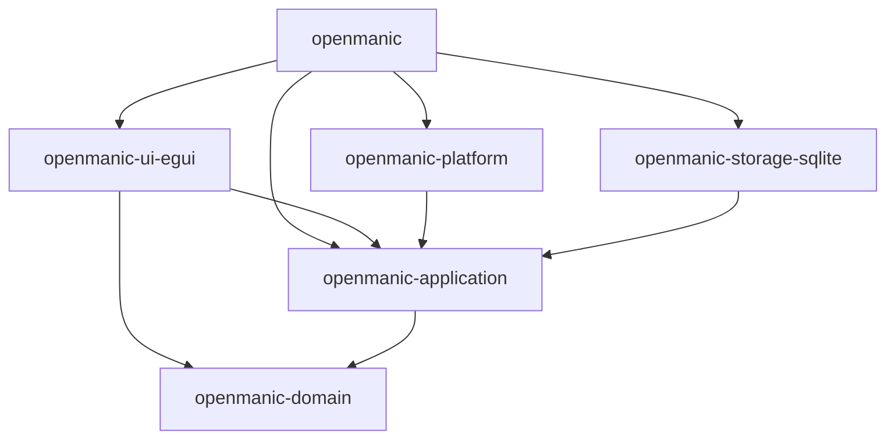
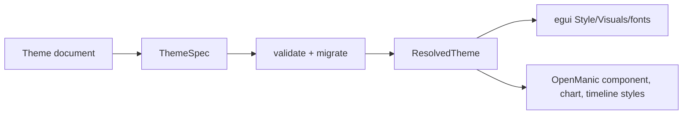

# OpenManic project and directory structure

## 1. Goals

The repository structure must make these questions easy to answer:

- Where is the authoritative product rule?
- Which code talks to egui, SQLite, or the operating system?
- Which direction may this dependency point?
- Where is a command handled and where is its result projected?
- Where do I add a screen, widget, migration, adapter, or test?

The structure uses Cargo crates only where a compile-time dependency boundary is valuable. It uses feature-oriented modules inside each crate so normal changes do not require navigating many tiny packages.

## 2. Workspace layout

```text
OpenManic/
├── .cargo/
│   └── config.toml
├── .editorconfig
├── Cargo.toml
├── Cargo.lock
├── clippy.toml
├── deny.toml
├── rust-toolchain.toml
├── rustfmt.toml
├── assets/
│   ├── icons/
│   └── themes/
│       ├── dark.toml
│       ├── light.toml
│       └── system.toml
├── fixtures/
│   └── performance/
│       ├── generator-config.toml
│       └── expected-metadata.json
├── crates/
│   ├── openmanic/
│   ├── openmanic-domain/
│   ├── openmanic-application/
│   ├── openmanic-storage-sqlite/
│   ├── openmanic-platform/
│   └── openmanic-ui-egui/
├── docs/
│   └── gui/
│       ├── openmanic-gui-product-requirements.md
│       └── spec/
└── tools/
    ├── fixture-generator/
    └── xtask/
```

The implementation SHOULD create only directories that contain real code or assets. Empty speculative folders make the tree harder to read.

## 3. Root Cargo policy

The virtual workspace root uses:

```toml
[workspace]
resolver = "3"
members = ["crates/*", "tools/*"]
default-members = ["crates/openmanic"]

[workspace.package]
edition = "2024"
publish = false

[workspace.dependencies]
# One tested version per dependency; members use `.workspace = true`.
```

Requirements:

- Commit `Cargo.lock`; this is an application.
- Pin a tested stable toolchain in `rust-toolchain.toml`.
- Centralize shared dependency versions, package metadata, and lints.
- Require every workspace member to inherit `[workspace.lints]` with `[lints] workspace = true`.
- Use target-specific dependency tables for Windows and future Linux-only code.
- Keep default features explicit for large/platform-sensitive crates.
- Run dependency feature and duplicate audits before release.
- Update dependencies deliberately as one reviewed change, not opportunistically across feature work.

The exact formatting, lint, unsafe-code, documentation, testing, and dependency gates are defined in [Code quality and readability](code-quality-standards.md). The root manifest owns these policies so a crate cannot silently drift from the workspace baseline.

## 4. Crate dependency rules



Forbidden edges:

```text
openmanic-domain          -X-> egui / eframe / rusqlite / OS APIs / channels
openmanic-application     -X-> concrete storage / concrete platform / egui
openmanic-ui-egui         -X-> openmanic-storage-sqlite / openmanic-platform
openmanic-storage-sqlite  -X-> openmanic-ui-egui
openmanic-platform        -X-> openmanic-ui-egui / rusqlite
```

The binary is the only crate allowed to know every concrete crate.

## 5. `openmanic-domain`

Purpose: pure entities, value objects, state machines, invariants, and policies.

```text
crates/openmanic-domain/
├── Cargo.toml
└── src/
    ├── lib.rs
    ├── ids.rs
    ├── time.rs
    ├── activity/
    │   ├── mod.rs
    │   ├── interval.rs
    │   ├── state.rs
    │   └── evidence.rs
    ├── application.rs
    ├── category.rs
    ├── focus/
    │   ├── mod.rs
    │   └── state_machine.rs
    ├── schedule/
    │   ├── mod.rs
    │   ├── recurrence.rs
    │   ├── exception.rs
    │   └── validation.rs
    ├── layout.rs
    └── saved_view.rs
```

Rules:

- `#![forbid(unsafe_code)]`.
- No infrastructure types.
- Constructors enforce local invariants.
- Cross-entity policies are named functions/services, not anonymous helpers.
- Domain enums are exhaustive and versioned at persistence/serialization boundaries.
- Unit/property tests live beside the module or in the crate’s `tests/` when exercising public behavior.

## 6. `openmanic-application`

Purpose: use cases, ports, commands/events, service coordination, projections, runtime supervision, and immutable snapshot contracts.

```text
crates/openmanic-application/
├── Cargo.toml
├── src/
│   ├── lib.rs
│   ├── ids.rs
│   ├── commands/
│   │   ├── mod.rs
│   │   ├── tracking.rs
│   │   ├── category.rs
│   │   ├── focus.rs
│   │   ├── schedule.rs
│   │   ├── layout.rs
│   │   ├── views.rs
│   │   └── jobs.rs
│   ├── events/
│   │   ├── mod.rs
│   │   ├── domain.rs
│   │   └── jobs.rs
│   ├── ports/
│   │   ├── mod.rs
│   │   ├── activity_adapter.rs
│   │   ├── clock.rs
│   │   ├── storage.rs
│   │   ├── files.rs
│   │   ├── notifications.rs
│   │   └── instance_activation.rs
│   ├── runtime/
│   │   ├── mod.rs
│   │   ├── channels.rs
│   │   ├── mailbox.rs
│   │   ├── cancellation.rs
│   │   ├── supervisor.rs
│   │   ├── service_health.rs
│   │   └── shutdown.rs
│   ├── services/
│   │   ├── mod.rs
│   │   ├── tracking.rs
│   │   ├── applications.rs
│   │   ├── categories.rs
│   │   ├── focus.rs
│   │   ├── schedule.rs
│   │   ├── layout.rs
│   │   └── import_export.rs
│   └── projection/
│       ├── mod.rs
│       ├── request.rs
│       ├── snapshot.rs
│       ├── timeline.rs
│       ├── overview.rs
│       ├── categories.rs
│       ├── calendar.rs
│       ├── widgets.rs
│       └── cache.rs
├── benches/
│   ├── timeline_projection.rs
│   └── schedule_expansion.rs
└── tests/
    ├── command_reconciliation.rs
    └── stale_result_rejection.rs
```

Rules:

- `#![forbid(unsafe_code)]`.
- Ports are defined by the use case that consumes them.
- Ports expose domain/application types, not adapter types.
- The application layer owns snapshot contracts; egui renderers only consume them.
- Each service has one obvious command handler entry point.
- Avoid a generic event bus. Enumerated commands/events make ownership and ordering visible.
- Do not add a `utils`, `common`, `manager`, or `misc` module.

## 7. `openmanic-storage-sqlite`

Purpose: implement application storage ports with bundled SQLite.

```text
crates/openmanic-storage-sqlite/
├── Cargo.toml
├── migrations/
│   └── 0001_initial.sql
├── src/
│   ├── lib.rs
│   ├── options.rs
│   ├── connection.rs
│   ├── migration.rs
│   ├── writer.rs
│   ├── read_session.rs
│   ├── revision.rs
│   ├── backup.rs
│   ├── recovery.rs
│   ├── staging.rs
│   └── repositories/
│       ├── mod.rs
│       ├── activity.rs
│       ├── applications.rs
│       ├── categories.rs
│       ├── focus.rs
│       ├── schedule.rs
│       ├── layout.rs
│       ├── views.rs
│       └── settings.rs
└── tests/
    ├── migrations.rs
    ├── recovery.rs
    └── repository_contracts.rs
```

Rules:

- The crate owns every `rusqlite::Connection`.
- No connection or SQL row type crosses its public API.
- SQL migrations are readable numbered files, not hidden inside builder calls.
- Repositories map explicitly between strict rows and domain types.
- One writer module serializes mutations; it is not a repository grab bag.
- Integration tests run against temporary real SQLite databases.
- `#![forbid(unsafe_code)]`.

## 8. `openmanic-platform`

Purpose: implement platform capability ports.

```text
crates/openmanic-platform/
├── Cargo.toml
├── src/
│   ├── lib.rs
│   ├── capabilities.rs
│   ├── identity.rs
│   ├── windows/
│   │   ├── mod.rs
│   │   ├── control_window.rs
│   │   ├── foreground.rs
│   │   ├── process_identity.rs
│   │   ├── title.rs
│   │   ├── idle.rs
│   │   ├── session.rs
│   │   ├── power.rs
│   │   ├── time_evidence.rs
│   │   ├── tray.rs
│   │   ├── autostart.rs
│   │   ├── single_instance.rs
│   │   └── notifications.rs
│   └── linux/
│       ├── mod.rs
│       ├── sway.rs
│       ├── x11_ewmh.rs
│       └── session.rs
└── tests/
    └── event_normalization.rs
```

The `linux` module is not compiled into the Windows MVP artifact and need not be created until NixOS work begins.

Rules:

- Target-specific dependencies and modules are guarded with `cfg` and Cargo target tables.
- Platform events are normalized before leaving the crate.
- Unsafe FFI, if required beyond `windows-rs`, is limited to small private modules with a written `SAFETY` explanation for every block.
- OS callbacks do minimal bounded work.
- The platform crate never persists or paints.

## 9. `openmanic-ui-egui`

Purpose: eframe lifecycle, `UiModel`, reducers, screens, dialogs, component styles, widget renderers, layout editing, theme resolution/application, and GUI tests.

```text
crates/openmanic-ui-egui/
├── Cargo.toml
├── src/
│   ├── lib.rs
│   ├── app.rs
│   ├── model.rs
│   ├── reducer.rs
│   ├── controller.rs
│   ├── repaint.rs
│   ├── shell/
│   │   ├── mod.rs
│   │   ├── navigation.rs
│   │   ├── status.rs
│   │   └── jobs.rs
│   ├── screens/
│   │   ├── mod.rs
│   │   ├── today.rs
│   │   ├── overview.rs
│   │   ├── categories.rs
│   │   ├── calendar.rs
│   │   └── settings.rs
│   ├── dialogs/
│   │   ├── mod.rs
│   │   ├── schedule.rs
│   │   ├── category.rs
│   │   ├── data_location.rs
│   │   └── recovery.rs
│   ├── components/
│   │   ├── mod.rs
│   │   ├── buttons.rs
│   │   ├── fields.rs
│   │   ├── progress.rs
│   │   └── states.rs
│   ├── widgets/
│   │   ├── mod.rs
│   │   ├── definition.rs
│   │   ├── registry.rs
│   │   ├── layout.rs
│   │   ├── usage.rs
│   │   ├── distribution.rs
│   │   ├── focus.rs
│   │   └── timeline/
│   │       ├── mod.rs
│   │       ├── geometry.rs
│   │       ├── hit_test.rs
│   │       ├── paint.rs
│   │       └── interaction.rs
│   └── theme/
│       ├── mod.rs
│       ├── spec.rs
│       ├── validation.rs
│       ├── migration.rs
│       ├── resolved.rs
│       ├── tokens.rs
│       └── egui_adapter.rs
├── benches/
│   └── timeline_geometry.rs
└── tests/
    ├── reducers.rs
    ├── widget_registry.rs
    └── theme_resolution.rs
```

Rules:

- `#![forbid(unsafe_code)]`.
- Renderers receive snapshots and emit typed actions.
- Screens do not construct storage/platform adapters.
- Timeline uses one interactive response plus indexed hit testing, not one egui widget per interval.
- Theme specification/resolution modules contain no persisted egui field names. Only `egui_adapter.rs` converts `ResolvedTheme` into egui types.
- Screen modules may compose widgets but do not own domain rules.

## 10. `openmanic` composition binary

Purpose: process startup, data-root resolution, diagnostics bootstrap, adapter construction, service wiring, top-level lifecycle, and eframe launch.

```text
crates/openmanic/
├── Cargo.toml
├── src/
│   ├── main.rs
│   ├── lib.rs
│   ├── cli.rs
│   ├── bootstrap.rs
│   ├── data_root.rs
│   ├── diagnostics.rs
│   ├── wiring.rs
│   └── lifecycle.rs
└── tests/
    └── windows_vertical_slice.rs
```

Rules:

- `#![forbid(unsafe_code)]`.
- Keep it thin; no product policy.
- Resolve single-instance and data location before opening SQLite.
- Install minimal diagnostics and panic hooks before starting workers.
- Make dependency wiring explicit in one place.
- Do not create a service-locator singleton.

## 11. Module naming and readability rules

- Name modules after product concepts: `schedule`, `activity`, `category`, `projection`.
- Avoid vague names: `helpers`, `common`, `core`, `stuff`, `misc`, `processor`, `handler` without a domain qualifier.
- Prefer `schedule::validation` over `validation_utils`.
- Prefer a small public facade in each crate’s `lib.rs`; implementation modules stay `pub(crate)`.
- Place a type beside the policy that owns it, not beside whichever screen first uses it.
- Use one source file until a module has distinct sub-concepts; do not create one-file directories mechanically.
- Split a file when navigation, ownership, or tests become clearer—not at an arbitrary line count.
- Each public type and non-obvious invariant gets rustdoc explaining ownership and failure behavior.
- Architecture terms in code match this specification; do not invent synonyms for commands, events, snapshots, activity states, or schedule edit scopes.

## 12. Error organization

Each crate exposes a small typed error boundary:

```text
DomainError
ApplicationError
StorageError
PlatformError
UiError
BootstrapError
```

Use `thiserror` for library errors. The binary may add context for diagnostics, but it MUST preserve stable error codes and sources needed for user recovery.

Do not return raw `rusqlite::Error`, `windows::core::Error`, or `std::io::Error` across the adapter boundary. Map them to typed variants with an optional diagnostic source.

## 13. Dependency baseline

| Need | Initial choice | Policy |
| --- | --- | --- |
| GUI | `egui` + `eframe` 0.35 | Pin together; explicit native features |
| Channels | `crossbeam-channel`; preallocated callback ingress from Crossbeam primitives or equivalent | Synchronous, bounded, no async runtime |
| SQLite | `rusqlite` | `default-features = false`; enable bundled SQLite and only required backup/cache/hooks features |
| Serialization | `serde` | JSON for validated persisted documents; TOML for human-authored themes/settings where applicable |
| Time zones | `jiff` | Central adapter module; no ad hoc offset arithmetic |
| Errors | `thiserror` | Typed crate boundaries |
| Diagnostics | `tracing`, `tracing-subscriber`, bounded writer | No titles in normal logs |
| CSV | `csv` | Streaming background import/export |
| Windows | Microsoft `windows` crate | Minimal Win32 namespaces; direct APIs in platform crate |
| Benchmarking | Criterion for pure functions plus instrumented eframe fixture | Criterion is not a substitute for frame measurements |

Do not add Tokio, Rayon, an ORM, a general plugin framework, or a second serialization system without a concrete requirement and measured benefit.

## 14. Feature policy

Suggested features:

```text
renderer-wgpu      exactly one release renderer
renderer-glow      benchmark/alternative artifact
dev-tools          profiler and diagnostic UI
platform-windows   Windows adapter and artifact
platform-linux     future Linux adapter artifact
```

Rules:

- A release artifact selects exactly one renderer and one platform family.
- Windows builds do not compile X11/Wayland dependencies.
- Linux builds do not compile Win32 implementation modules.
- `dev-tools` is disabled in normal release builds.
- Future encryption remains a separate post-MVP feature and dependency boundary.
- Features are additive capabilities; avoid mutually inconsistent feature combinations where possible.

## 15. Theme structure

The theme path is:



`ThemeSpec` and `ResolvedTheme` are OpenManic-owned types. The public/persisted schema never serializes `egui::Style` or egui release-specific field names.

The source files may live in the UI crate initially, but imports from egui are restricted to the final adapter and renderer modules. If this rule becomes difficult to enforce, theme specification/resolution is the first candidate for a seventh crate; it is not split preemptively.

## 16. Widget structure

A first-party widget addition normally touches:

1. Domain types only if it introduces a real product fact.
2. Application projection request/snapshot types.
3. UI widget definition/renderer.
4. Widget registry entry.
5. Configuration migration and tests.

The Today screen MUST not add a `match` branch containing every renderer. The registry maps stable kind IDs to definitions and renderer factories.

Widget renderers never query ports. Configuration changes emit actions, and the application produces a new correlated snapshot.

## 17. Development entry points

The repository SHOULD support these ordinary commands after installing only the pinned Rust toolchain:

```powershell
cargo xtask quality
cargo build --workspace
cargo run -p openmanic --features renderer-wgpu,platform-windows
```

`cargo xtask quality` is the canonical local entry point and the main CI stage. It runs formatting, locked workspace checks, Clippy with warnings denied, tests, rustdoc, and specification-link checks using the exact commands in [Code quality and readability](code-quality-standards.md). It does not rewrite files or install tools. CI and release checks additionally run the separately pinned `cargo-deny` executable through `cargo xtask dependency-check`.

SQLite is bundled; the developer does not install a database server. The fixture generator and quality runner are Rust workspace tools.

Platform integration tests that alter autostart, session state, sleep, or shutdown are explicitly labeled and not part of an ordinary unit-test run.

## 18. Promotion rule for new crates

Split a module into another crate only when at least one is true:

- A dependency direction must be compile-time enforced and cannot be kept clean inside the crate.
- The module needs substantially different target features or build behavior.
- Independent compilation/test time materially improves development.
- The module has a stable reusable API and ownership separate from its current parent.
- Its current crate has become difficult to navigate despite clear modules.

Possible later candidates are theme schema/resolution, a large analytics engine, or a mature cross-platform adapter API. They are not initial crates.

## 19. Structure acceptance checks

- `cargo tree` contains no UI -> storage/platform edge.
- Only the platform crate references Win32/Sway/X11 implementation symbols.
- Only the storage crate contains SQL/rusqlite connection code.
- Only the UI crate imports egui/eframe types.
- The binary contains wiring rather than product decisions.
- Search for a product noun leads to one primary module instead of several generic managers.
- New contributors can find the command, service, repository, projection, and renderer of a feature by following the same naming pattern.
- No release artifact includes both GUI renderers or both platform families accidentally.
- Every workspace member inherits root lints, and `cargo xtask quality` passes from a fresh checkout with the pinned toolchain.

## 20. Primary references

- [Cargo workspace reference](https://doc.rust-lang.org/cargo/reference/workspaces.html)
- [Cargo resolver](https://doc.rust-lang.org/cargo/reference/resolver.html)
- [Cargo features](https://doc.rust-lang.org/cargo/reference/features.html)
- [Cargo project layout](https://doc.rust-lang.org/cargo/guide/project-layout.html)
- [Cargo workspace lint inheritance](https://doc.rust-lang.org/cargo/reference/workspaces.html#the-lints-table)
- [OpenManic code quality and readability standard](code-quality-standards.md)
- [eframe features](https://docs.rs/crate/eframe/latest/features)
