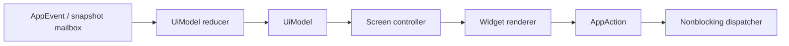

# OpenManic MVP UI implementation specification

## 1. Purpose

This document resolves UI-specific architecture decisions left open by the product requirements: screen/controller ownership, dashboard grid behavior, widget registration and migration, theme syntax and resolution, timeline projection, gesture arbitration, and loading/error presentation.

The product requirements remain canonical for visible feature behavior and visual-design direction. Exact colors, fonts, spacing values, radii, shadows, navigation placement, and chart form remain visual-design decisions expressed through the schema defined here.

## 2. UI layer ownership



### 2.1 `UiModel`

`UiModel` owns:

- Route and retained per-route navigation state.
- Selected date/range.
- Shared filters and timeline selection.
- References to current immutable snapshots.
- Active/pending jobs and user-facing errors.
- Active and draft dashboard layout.
- Schedule/category/settings form drafts.
- Theme choice and resolved theme revision.
- Pending command correlation.

It does not own authoritative activity, application/category assignment, schedule rules, focus lifecycle, or persisted layout/view state.

### 2.2 Screen controllers

Each primary destination has one controller module:

```text
TodayController
OverviewController
CategoriesController
CalendarController
SettingsController
```

A controller:

- Derives a normalized projection request from `UiModel`.
- Selects current snapshots.
- Coordinates child widgets and dialogs.
- Converts screen interactions into typed actions.
- Owns route-specific transient state.

A controller never calls storage or platform APIs.

## 3. Shared selection and filters

```rust
struct SharedViewContext {
    selected_date_or_range: DateRangeSpec,
    time_zone: ResolvedTimeZoneId,
    timeline_selection: Option<TimeRange>,
    application_filter: Set<ApplicationId>,
    category_filter: Set<CategoryIdOrUncategorized>,
    activity_state_filter: Set<ActivityState>,
}
```

The effective range is:

```text
selected date/range
INTERSECT optional timeline selection
INTERSECT application filter
INTERSECT category filter
INTERSECT activity-state filter
```

Every active narrowing criterion is visible and independently removable. Navigating to an incompatible date clears the timeline selection but preserves compatible explicit filters.

Changing context increments the target projection slot’s request sequence. Compatible widgets share a normalized context key and MAY reuse the same projection.

## 4. Responsive dashboard grid

### 4.1 Canonical model

The saved desktop layout uses a 12-column canonical grid:

```rust
struct WidgetPlacement {
    instance_id: WidgetInstanceId,
    kind_id: WidgetKindId,
    kind_schema_version: u16,
    order: u32,
    width_span_12: u8,
    height_class: HeightClass,
    config: VersionedWidgetConfig,
    appearance: Option<VersionedAppearanceOverrides>,
}

enum HeightClass {
    Compact,
    Standard,
    Tall,
}
```

The layout stores order and span, not pixel coordinates or transient responsive positions.

### 4.2 Active column counts

Using the allocated dashboard width in logical pixels:

| Width | Active columns |
| --- | ---: |
| `>= 1200` | 12 |
| `900..1199` | 8 |
| `720..899` | 4 |
| `< 720` | 4 inside a minimum-width/scroll-safe shell; below 720 is not an optimized MVP width |

Semantic theme spacing is subtracted before selecting the usable grid width.

### 4.3 Allowed spans

| Active columns | Allowed effective spans |
| --- | --- |
| 12 | 3, 4, 6, 8, 9, 12 |
| 8 | 2, 3, 4, 5, 6, 8 |
| 4 | 2, 4 |

Each widget definition provides a minimum span for each active-column mode. Timeline minimum is full width in four-column mode.

### 4.4 Reflow algorithm

For every widget sorted by `(order, instance_id)`:

1. Scale the saved span: `ceil(width_span_12 * active_columns / 12)`.
2. Snap to the nearest allowed span that is not smaller than the scaled result.
3. Clamp to the widget’s minimum and the active column count.
4. Place the widget in the earliest row with a contiguous run of free columns, scanning rows top-to-bottom and columns left-to-right.
5. If no run fits, append a row.
6. Resolve height from `height_class` and the widget definition’s semantic minimum/preferred height.

This is deterministic first-fit packing. It does not reorder widgets to fill holes. Responsive placements are derived in memory and never overwrite the saved 12-column layout.

### 4.5 Default widget sizing

| Widget | Canonical minimum | Preferred | Height |
| --- | ---: | ---: | --- |
| Activity timeline | 6 | 12 | Tall |
| Application usage | 3 | 4 | Standard |
| Time distribution | 3 | 4 | Standard |
| Pomodoro/focus | 3 | 4 | Standard |

Each renderer must also implement its product-required compact mode. Visual design may change preferred height values through semantic component metrics without changing persisted classes.

### 4.6 Edit mode

- Enter through an explicit Edit layout action.
- Each widget shows a labeled drag handle and resize control.
- Reorder changes the linear `order`; the grid previews the deterministic placement.
- Resize steps through valid canonical spans declared by the widget.
- Height steps only through supported classes.
- The main widget body does not initiate move/resize.
- Save validates and persists the complete layout as one document.
- Cancel restores the exact layout/document active on entry.
- Reset loads the versioned built-in default as a draft; Save commits it.
- Escape cancels the active drag/resize before it closes edit mode.

Direct drag-and-drop MAY supplement accessible labeled move commands, but it must produce the same order/span result.

## 5. Widget registry contract

### 5.1 Definition

```rust
struct WidgetDefinition {
    kind_id: WidgetKindId,
    schema_version: u16,
    display: WidgetPickerMetadata,
    capabilities: WidgetCapabilities,
    sizes: WidgetSizePolicy,
    config: WidgetConfigContract,
    appearance: AppearanceOverrideContract,
    projection_dependencies: Vec<ProjectionDependency>,
    allowed_actions: Set<AppActionKind>,
    snapshot_schema_revision: u16,
}
```

`WidgetKindId` is a stable reverse-domain-like string owned by OpenManic, for example `openmanic.timeline.day`. Renaming the Rust type does not change the kind ID.

### 5.2 Renderer

```rust
trait WidgetRenderer {
    fn render(
        &mut self,
        ui: &mut egui::Ui,
        snapshot: WidgetSnapshotRef<'_>,
        context: &WidgetRenderContext<'_>,
        actions: &mut Vec<AppAction>,
    );
}
```

The renderer may keep transient hover/drag/animation state. It may not query a port, spawn a worker, mutate canonical data, or wait for a result.

### 5.3 Registration

- First-party definitions/renderers are compiled and registered at bootstrap.
- Registry construction fails loudly in development/tests on duplicate kind IDs or unsupported schema ranges.
- In release, a missing/incompatible saved kind becomes a recoverable placeholder with Remove and Reset actions.
- The main Today screen iterates registry/layout instances and does not contain a branch for every widget kind.
- Multiple instances share a kind definition but have distinct instance IDs/configurations/projection slots.

### 5.4 Configuration migration

For every schema step `N -> N+1`, a widget supplies a deterministic migration or explicitly declares incompatibility.

Migration sequence:

1. Parse the stored versioned value into a bounded generic representation.
2. Apply each migration exactly once.
3. Validate the final typed config.
4. Preserve the original source for diagnostics if any step fails.
5. Use widget defaults in the recoverable placeholder/fallback path.
6. Persist migrated config only after the complete layout validates.

## 6. Timeline projection contract

### 6.1 Snapshot shape

```rust
struct TimelineSnapshot {
    context: TimelineContext,
    source_revision: DataRevision,
    visible_range: UtcRange,
    category_band: IntervalIndex<CategoryBandValue>,
    activity_band: IntervalIndex<ActivityStateValue>,
    application_band: IntervalIndex<ApplicationBandValue>,
    schedules: Arc<[ScheduleOccurrenceView]>,
    focus_sessions: Arc<[FocusSessionView]>,
    totals: TimelineTotals,
    completeness: DataCompleteness,
}
```

Band values:

```text
CategoryBandValue
  Category(CategoryId)
  Uncategorized
  NonApplicationState(ActivityState)

ActivityStateValue
  Active / Idle / PausedByUser / Excluded / Unavailable / PoweredOff / UnknownMissing

ApplicationBandValue
  Application(ApplicationId)
  NoApplication(ActivityState)
  UnresolvedApplication
```

### 6.2 Gap-free projection

For the requested range:

1. Load canonical activity intervals intersecting the range.
2. Clip at range boundaries without changing stored rows.
3. Insert explicit `UnknownMissing` values for unexplained uncovered time.
4. Map Active application intervals to current category assignment or Uncategorized.
5. Map non-application activity states to explicit non-application values in Category and Application bands.
6. Coalesce adjacent equal presentation values independently per band.
7. Preserve stable source IDs/boundaries for exact inspection.
8. Expand schedules for the local range and load focus overlays.
9. Build independent binary-search indexes.

Powered Off is a real indexed Activity-band segment whose paint fill is intentionally absent. It remains hoverable/selectable through geometry created from the segment range.

Each band may have different boundaries. They share one time transform, not one forced segmentation.

### 6.3 Dense rendering

The snapshot retains raw projected intervals. The UI may create a second paint-only representation when several boundaries map inside one pixel:

- Use deterministic bins over the visible time transform.
- Preserve exact totals from raw intervals.
- Use raw indexes for pointer hit testing after converting pointer X to time.
- Never write aggregation back to SQLite or the canonical snapshot.

## 7. Timeline and schedule gesture arbitration

### 7.1 Normal timeline mode

| Input | Behavior |
| --- | --- |
| Primary click on segment | Select segment and show persistent details/actions |
| Primary click on non-segment/empty timeline area | Clear selection |
| Primary horizontal drag beyond 4 logical pixels | Create range selection |
| Mouse wheel over timeline | Pointer-anchored continuous zoom |
| Shift + wheel or horizontal precision-scroll | Horizontal pan |
| Middle-button drag or Space + primary drag | Horizontal pan |
| Escape | Cancel active drag or clear transient hover/popup |
| Reset View control | Restore default day range |

Toolbar/buttons provide Zoom In, Zoom Out, and Reset View so essential navigation does not rely only on wheel/modifier gestures.

A movement smaller than the drag threshold remains a click. Once a drag crosses the threshold, it remains that operation until release.

### 7.2 Create Schedule mode

- The shell/timeline visibly labels the active mode.
- Primary drag defines the provisional schedule range instead of a normal range selection.
- Exact start/end feedback and the bracket preview update during drag.
- Release opens the shared schedule editor.
- Wheel zoom and middle/Space pan remain available.
- Escape or Cancel exits without mutation.
- Existing schedule brackets remain selectable for edit, but dragging ordinary activity never silently creates one outside this mode.

### 7.3 Schedule edit

- Clicking a bracket selects it and opens details/edit.
- Only visible start/end handles adjust boundaries directly.
- Dragging the bracket body does not move it in the MVP unless visual design explicitly adds a labeled move affordance.
- Boundary drag uses the product-defined snap increment while the form permits exact typed values.
- Save is a command; the provisional bracket remains pending until authoritative acceptance.

### 7.4 Layout edit isolation

Dashboard layout edit mode intercepts only widget header handles, placement targets, and resize controls. Timeline/content gestures are disabled or visually blocked inside a widget being manipulated. Leaving edit mode restores normal widget interaction.

## 8. Calendar interaction

Calendar uses the same `ScheduleOccurrenceView`, schedule commands, editor, snap increment, validation errors, and edit-scope dialog as Timeline.

- Vertical primary drag in Create Schedule mode defines a range.
- Standard scrolling scrolls the day surface.
- Bracket handles use the vertical time transform.
- Overnight occurrences display the clipped portion plus continuation metadata.
- Selecting recorded activity carries its UTC range/application into a corresponding Today timeline context.

Neither screen owns a schedule copy.

## 9. Theme format

### 9.1 Syntax

The public theme document uses TOML. It is declarative, non-executable, versioned, and independent of egui field names.

Illustrative version-1 shape:

```toml
schema_version = 1
id = "openmanic.dark"
display_name = "OpenManic Dark"

[colors]
canvas = "#111318"
panel = "#171a20"
content_primary = "#f2f4f8"
content_secondary = "#a9b0bd"
interaction_primary = "#6d8cff"
state_error = "#e66a6a"

[spacing]
unit = 4.0
panel_padding = 4
control_gap = 2

[radius]
control = 2
panel = 3

[stroke]
standard_width = 1.0
focus_width = 2.0

[typography]
body_family = "bundled-sans"
body_size = 14.0
heading_size = 18.0

[component.button.primary]
surface = { ref = "colors.interaction_primary" }
content = { ref = "colors.canvas" }

[timeline]
grid = { ref = "colors.content_secondary" }
powered_off_fill = "none"
selection = { ref = "colors.interaction_primary" }

[motion]
fast_ms = 90
normal_ms = 160
```

The final bundled token values are visual-design outputs; the schema categories and resolution rules are architectural.

### 9.2 Schema groups

Version 1 supports:

- Metadata and schema version.
- Semantic colors.
- Spacing and padding scales.
- Radii.
- Strokes.
- Typography and bundled font references.
- Icon sizes.
- Motion timings.
- Standard component variants/states.
- Chart series.
- Timeline bands/grid/cursor/selection.
- Schedule bracket geometry/style.
- Focus/status/error states.

Unknown required fields, invalid types, cycles, unknown references, invalid colors/ranges, or missing essential semantics reject the theme.

### 9.3 References and resolution

References use an explicit object:

```toml
surface = { ref = "colors.panel" }
```

Rules:

- References are exact dotted paths; no selector cascade or arbitrary expression language.
- Cycles are rejected with the reference path.
- A token resolves to a typed value before component inheritance.
- Component states inherit only from documented base variants.
- User-authored executable code, selectors, imports, network assets, and raw CSS/QSS are forbidden.

Resolution order:

1. Bundled base theme.
2. Widget-kind defaults.
3. Valid widget-instance appearance overrides.
4. Temporary interaction state.

`ResolvedTheme` converts atomically into:

- egui `Style`, `Visuals`, and fonts.
- OpenManic standard component styles.
- Timeline/chart/schedule/custom-widget styles.

A failed parse/reload preserves the previous complete resolved theme.

### 9.4 Built-in modes

Dark, Light, and Follow System use the same `ThemeSpec` path. Follow System selects the validated bundled Dark or Light theme according to the OS preference; it is not a separate uncontrolled egui style.

Theme import/export/editor is post-MVP. Development live reload is behind `dev-tools`.

## 10. Loading and error presentation

Every data-driven view/widget implements:

```rust
enum PresentableData<T> {
    InitialLoading,
    Ready(Arc<T>),
    Refreshing { prior: Arc<T>, job: JobId },
    Empty(EmptyReason),
    Partial { value: Arc<T>, limitations: Vec<DataLimitation> },
    Failed { prior: Option<Arc<T>>, error: UserFacingError },
    Recovered { value: Arc<T>, notice: RecoveryNotice },
}
```

Tracking Paused and Tracking Unavailable are explicit data limitations/states, not generic Empty.

- Refreshing preserves prior data.
- A stale result cannot clear newer content.
- Error actions are local where possible.
- Technical details are expandable/copyable.
- Background errors never steal keyboard focus.

## 11. Progressive-disclosure layers

| Layer | Content |
| --- | --- |
| Default | Application name, time, category, schedule, tracking/focus status, primary action |
| Secondary | Exact start/end/duration, executable distinction, active filters, recurrence summary |
| Advanced | Executable paths, time-zone IDs, data location, import/export controls, detailed settings |
| Diagnostics | Adapter source/confidence, platform errors, revisions, query timing, migration/log details |

The default interface never uses implementation terms such as HWND, PID, adapter, transaction, projection, or recurrence segment.

## 12. Accessibility-preserving contracts

Although full custom-graph accessibility is post-MVP, the implementation MUST preserve:

- Stable segment, schedule, widget, and action IDs.
- Descriptive names and exact start/end/duration in snapshots.
- Normal egui keyboard behavior for conventional controls.
- Visible focus and selection.
- Text/icon support in addition to color.
- Ordinary form controls for precise schedule/category/settings edits.
- Renderer boundaries that can later expose an AccessKit tree or synchronized structured view without changing the domain model.

## 13. UI verification

In addition to the product-document GUI tests:

- Grid placement is deterministic for every active column count.
- Responsive reflow does not change the persisted document.
- Save/Cancel/Reset and missing-renderer fallback preserve identity/configuration correctly.
- Widget configuration migration is deterministic and atomic with layout validation.
- Each timeline mode has unambiguous pointer capture and Escape behavior.
- One timeline interaction response handles 10,000 raw intervals.
- Band indexes remain gap-free and independently segmented.
- Theme reference cycles/unknown tokens fail without partial application.
- Standard egui and custom-painted components consume the same resolved theme revision.
- All `PresentableData` states render without blanking valid prior data.

## 14. Primary references

- [egui `Ui`](https://docs.rs/egui/latest/egui/struct.Ui.html)
- [egui `Response`](https://docs.rs/egui/latest/egui/struct.Response.html)
- [eframe application lifecycle](https://docs.rs/eframe/latest/eframe/trait.App.html)
- [egui style](https://docs.rs/egui/latest/egui/style/struct.Style.html)
